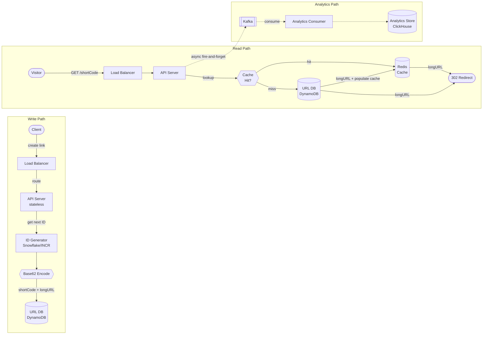

# Solution Guide — URL Shortener

Read after your attempt. If you haven't attempted it yet, close this file.

---

## Component Map

| Component | Role | Technology Choice | Why |
|-----------|------|-------------------|-----|
| API Service | Handles create + redirect HTTP | Stateless app servers (Go/Java) | Horizontal scale; no session state |
| Short Code Generator | Produces unique 6–7 char codes | Counter + Base62 encoding | Predictable length, no collisions, no DB re-reads |
| URL Store | Durable `shortCode → longURL` mapping | DynamoDB / Cassandra (KV) | Write-once, read-many; no joins needed |
| Redirect Cache | Absorbs 95%+ of redirect reads | Redis (in-memory) | Sub-millisecond lookup; < 50 ms SLA requires it |
| Analytics Queue | Decouples click events from redirect path | Kafka | Async; absorbs spikes; Bitly runs millions events/sec |
| Analytics Store | Stores aggregated click data | ClickHouse / Cassandra | Time-series writes; range scan queries |
| ID Generator | Globally unique monotonic IDs | Snowflake-style or Redis INCR with HA | Avoid SPOF on a single counter |
| CDN (advanced) | Cache 302 redirects at edge | CloudFront / Fastly | Eliminates origin hits for viral links |

---

## Architecture Diagram



---

## Capacity Math

Start from stated scale and derive every number. Identify the bottleneck at each layer.

**Write QPS (link creation):**
- 100 million new links/month
- 100M ÷ 30 days ÷ 86,400 sec ≈ **38 writes/sec average**
- Bitly real number (Jan 2026): 256M links/month ≈ 93 writes/sec
- Peak writes (batch import / campaign launch): ~5× average = ~465 writes/sec

**Read QPS (redirects):**
- 10 billion redirects/month
- 10B ÷ 30 ÷ 86,400 ≈ **3,858 redirects/sec average**
- Read:write ratio = 3,858 / 38 ≈ **~100:1** — confirms read-dominated
- Peak redirects (viral spike, 100 million clicks/day spread unevenly):
  - 100M ÷ 86,400 ≈ 1,157 avg for that day
  - Viral spike at 50× average sustained QPS = **~190K redirect QPS**
  - Bitly reports peak ~100K redirect QPS — use that as design target

**Conclusion from QPS:** The redirect path must not touch the database on every request. With even 50% cache hit rate, each cache miss still means ~50K DB reads/sec — far more than a single DB instance handles. With 95% hit rate, DB sees ~5K QPS — manageable with read replicas.

**Storage:**
- Short URL record: shortCode (8B) + longURL (200B avg) + userId (16B) + createdAt (8B) + expiresAt (8B) + clickCount (8B) + metadata (~250B) ≈ **500 bytes/record**
- 100M links/month × 12 months × 5 years = **6 billion links over 5 years**
- Storage: 6B × 500B = **3 TB raw** (plus indexes, replication: ~15 TB total)
- Bitly's actual estimate: ~500 bytes/record aligns with public engineering posts

**Short code namespace:**
- Base62 (a-z, A-Z, 0-9) = 62 characters
- 7-character code = 62^7 = **3.5 trillion unique codes** — more than enough for 6B links
- 6-character code = 62^6 = **56 billion** — also sufficient but tighter margin

**Bandwidth:**
- Redirect response: ~500 bytes HTTP response (headers + Location header)
- 3,858 redirects/sec × 500 bytes = **~1.9 MB/sec** on redirect path — trivial
- Peak: 100K redirects/sec × 500 bytes = **50 MB/sec** — still manageable per server
- Analytics event stream: 3,858 events/sec × 200 bytes = **~770 KB/sec** into Kafka

**Bottleneck identification:**
1. **Cache** is the bottleneck for latency — without it, 3,858 DB reads/sec at peak is fine but p99 latency blows up
2. **Kafka / analytics pipeline** is the bottleneck for analytics durability — synchronous DB write per click would serialize the hot path
3. **ID generator** is a potential SPOF — must be HA

---

## API Design

### Create Short URL

```
POST /api/v1/shorten
Authorization: Bearer <token>
Content-Type: application/json

{
  "longUrl": "https://www.example.com/very/long/path?with=params",
  "customAlias": "myproduct",          // optional
  "expiresAt": "2027-01-01T00:00:00Z"  // optional, ISO8601
}

Response 201 Created:
{
  "shortUrl": "https://sho.rt/x7kP2q",
  "shortCode": "x7kP2q",
  "longUrl": "https://www.example.com/very/long/path?with=params",
  "createdAt": "2026-06-28T10:00:00Z",
  "expiresAt": "2027-01-01T00:00:00Z"
}

Response 409 Conflict: (custom alias already taken)
Response 422 Unprocessable: (longUrl invalid / blocked)
```

**Idempotency note:** POSTing the same longUrl twice creates two different short codes. This is intentional — creators may want separate analytics per campaign.

### Redirect

```
GET /:shortCode
(no auth required)

Response 302 Found:
Location: https://www.example.com/very/long/path?with=params

Response 404 Not Found: (shortCode doesn't exist)
Response 410 Gone: (shortCode existed but has expired)
```

**Why not 301?** — See Decision 2 below. This is the #1 gotcha.

### Get Analytics

```
GET /api/v1/analytics/:shortCode?from=2026-01-01&to=2026-06-28&granularity=day
Authorization: Bearer <token>

Response 200:
{
  "shortCode": "x7kP2q",
  "totalClicks": 148392,
  "uniqueVisitors": 91204,
  "timeSeries": [
    { "date": "2026-06-27", "clicks": 3847 },
    ...
  ],
  "topReferrers": [...],
  "topCountries": [...]
}
```

### Delete / Deactivate

```
DELETE /api/v1/links/:shortCode
Authorization: Bearer <token>

Response 204 No Content
Response 403 Forbidden: (not owner)
```

---

## Data Model

### URL Table (primary store)

```
Table: urls (DynamoDB or Cassandra)

  shortCode    : String (8 chars, Base62)     PARTITION KEY
  longUrl      : String (up to 2048 chars)
  userId       : String (UUID, FK to users)
  createdAt    : Timestamp (epoch ms)
  expiresAt    : Timestamp | null
  isActive     : Boolean
  customAlias  : Boolean (was this user-specified?)

Indexes:
  - Primary: shortCode (hash key) → O(1) lookup on redirect
  - GSI: userId → all links for a user (analytics, management)

Why DynamoDB / KV over relational:
  - Access pattern is 99.9% "give me longUrl for this shortCode"
  - No joins, no aggregations needed on this table
  - KV stores optimize for exactly this: hash(key) → value
  - DynamoDB handles auto-sharding; no manual partitioning needed
  - RDS would work at small scale but needs careful sharding plan at Bitly scale
```

### Analytics Events (time-series)

```
Table: click_events (ClickHouse / Cassandra)

  shortCode    : String          PARTITION KEY
  clickedAt    : Timestamp       CLUSTERING KEY (descending)
  referrer     : String
  userAgent    : String
  ipRegion     : String (coarse geo — not full IP for GDPR)
  sessionHash  : String (anonymized, for dedup)

Why ClickHouse:
  - Time-series append-only workload — inserts never update
  - Column-oriented: fast aggregations over clicks_by_day, top_referrers
  - Handles Bitly-scale (10B events/month) on commodity hardware
  - Supports exactly the query patterns analytics needs
```

---

## Key Design Decisions

### Decision 1: Short Code Generation Strategy

**Choice made:** Distributed counter (Snowflake-style 64-bit ID) encoded to Base62.

How it works: a dedicated ID generator service maintains a monotonically increasing counter. Each new link creation requests an ID. The 64-bit integer is Base62-encoded: `id_to_base62(12345678)` → `"x7kP2q"` (6–7 characters for IDs up to ~3.5 trillion). The shortCode is the Base62-encoded ID, not a hash.

**Alternative considered: MD5 hash truncation.** Take the MD5 of the long URL, take the first 6 characters of the hex string. Rejected because:
1. **Collision problem:** 16^6 = 16 million possible values; at 6 billion links, birthday paradox guarantees massive collisions. Each collision requires a DB read to detect, a retry loop, and more DB reads — adds latency proportional to collision frequency.
2. **Deterministic = security issue:** two people submitting the same long URL get the same short code, leaking that someone else shortened the URL, and potentially exposing internal URLs.
3. **No natural ordering:** harder to reason about namespace exhaustion or distribute generation.

**Alternative considered: Random Base62.** `crypto/rand` 7-character string. Rejected because:
1. Still requires a DB read to check for collision before committing.
2. Under high write load, collision checking becomes a hot DB path.

**Trade-off accepted with counter approach:** sequential codes are guessable. A determined attacker can enumerate `aaaaa1`, `aaaaa2`, etc. Mitigation: add a small random salt to the encoding, or use a bijective scrambling function on the ID before encoding so the output is non-sequential but still unique.

### Decision 2: 301 vs 302 Redirect

**Choice made:** 302 Found (temporary redirect).

**Why this is the most important decision for analytics:** HTTP 301 means "this resource has permanently moved." Browsers and HTTP clients cache 301 responses indefinitely. After the first click, every subsequent click from that browser never reaches your server — the browser resolves the redirect locally. You lose all analytics data. You cannot measure campaign performance. You cannot detect abuse. You cannot update the destination URL.

HTTP 302 means "temporarily found at this location." Clients do not cache 302 responses by default. Every click reaches the server. You can count it, attribute it, and — critically — if you later want to change the destination URL, all existing links continue to work.

**Trade-off accepted:** 302 means every click hits at least one server (the API server, if not the origin DB). This is the reason the cache is so critical. With a warm cache, a 302 redirect costs: CDN miss → API server → Redis lookup (~0.5 ms) → 302 response. Acceptable. With no cache, every click hits the DB — that's the failure mode.

**Alternative considered:** 301 with analytics proxy. Route every click through a server before issuing the 301, logging first. Rejected — this is effectively what 302 does, with extra complexity.

### Decision 3: Caching Strategy

**Choice made:** Redis read-through cache, `shortCode → longUrl`, with LRU eviction, TTL aligned to link expiry.

The read path runs at 3,858 QPS average and up to 100K QPS peak. The database has no hope of serving 100K QPS with < 50 ms p99 latency. Redis easily handles 100K+ QPS at < 1 ms latency on a single node.

**Cache sizing:** the access pattern follows a power law — a small fraction of links (viral ones) receive the vast majority of clicks. A cache of 20% of active links probably absorbs 80–90% of traffic. With 6 billion total links but ~10 million "active" links (clicked in the last 30 days), a 5 GB Redis cache (10M × 500 bytes) covers the hot set.

**Cache-aside vs read-through:** read-through is preferred here. On a cache miss, the API server fetches from DB and populates the cache atomically. This prevents cache stampedes for newly-viral links. For extreme stampede protection, use probabilistic early recomputation (fetch before expiry, jitter TTLs).

**Cache invalidation:** when a link is deleted or expires, invalidate the cache entry immediately. This is the only hard invalidation case. TTL-based expiry handles the rest.

**Alternative considered:** CDN caching of the redirect response itself. CloudFront can cache 302 responses at the edge with a short TTL (e.g., 5 minutes). This eliminates origin hits for viral links entirely but adds 5-minute lag for expiry or destination changes. Valid for advanced optimization, not the baseline design.

### Decision 4: Database Choice

**Choice made:** DynamoDB (or Cassandra) — key-value store.

**Why not PostgreSQL / MySQL?** At 100K redirect QPS, even with read replicas, a relational DB becomes a bottleneck. The URL table has zero joins and zero aggregations — the only query is `SELECT longUrl WHERE shortCode = ?`. Running a relational DB for a pure key-value access pattern is using the wrong tool. Relational databases add overhead (MVCC, buffer pool management, query planner) that is pure waste for this access pattern.

DynamoDB provides single-digit millisecond read latency at any scale, automatic sharding, and managed replication. Cassandra provides similar guarantees self-hosted. Both are architected for exactly this pattern.

**Trade-off accepted:** no ad-hoc queries over URL data. Analytics queries (clicks by user, links created this month) must go through the GSI or a separate analytics store. Acceptable — analytics is a separate read path anyway.

---

## Deep Dive: The Redirect Hot Path

Every millisecond matters here. The candidate should be able to walk through what happens internally when a visitor clicks a short link.

**Step 1: DNS + TCP (external, ~10–50 ms on first connection)**
The visitor's browser resolves `sho.rt` → IP. TLS handshake happens once; HTTP/2 multiplexing keeps connection alive for subsequent requests.

**Step 2: API Server receives GET /:shortCode**
The API server is stateless. Any instance can handle any request. Load balancer distributes via round-robin or least-connections.

**Step 3: Cache lookup (Redis, ~0.5–1 ms)**
`GET shortCode` in Redis. On hit (95%+ of the time): return the longUrl immediately, issue 302, proceed to Step 6.

**Step 4: DB fallback (only on cache miss, ~5–10 ms)**
`GetItem` call to DynamoDB with shortCode as the partition key. DynamoDB routes to the correct shard via consistent hashing. Single-digit ms response.

Fetch also checks: `isActive` (if false, return 410 Gone), `expiresAt` (if past, return 410 Gone).

**Step 5: Cache population**
Store `shortCode → longUrl` in Redis with TTL = min(link expiry, 24 hours). This prevents the next request from hitting the DB.

**Step 6: Issue 302 response (~0.1 ms)**
```
HTTP/1.1 302 Found
Location: https://original.long.url/...
Cache-Control: no-store
X-Request-ID: <trace-id>
```

**Step 7: Fire analytics event (async, non-blocking)**
After the response is sent (or concurrently), enqueue a click event to Kafka:
```json
{
  "shortCode": "x7kP2q",
  "clickedAt": 1751107200000,
  "referrer": "https://twitter.com/...",
  "userAgent": "Mozilla/5.0...",
  "ipRegion": "US-CA"
}
```
This is fire-and-forget. If Kafka is temporarily unavailable, the redirect still succeeds. Analytics may lag or lose events — acceptable per the NFR (eventually consistent, < 5 min lag).

**Total redirect latency budget:**
- Cache hit path: ~1–5 ms server processing + network
- Cache miss path: ~10–15 ms server processing + network
- Both well within 50 ms p99 SLA under normal conditions

**Failure scenario: Redis is down**
Traffic falls through to DynamoDB. At 100K QPS, DynamoDB can handle this if provisioned with sufficient read capacity units (RCUs), but cost spikes. The redirect still works — Redis is a performance optimization, not a hard dependency.

---

## Failure Modes & Mitigations

| Component | Failure Mode | Mitigation | Trade-off Accepted |
|-----------|-------------|------------|-------------------|
| Redis cache | Node failure / eviction storm | Redis Cluster (3 primary + 3 replica); circuit breaker to fall through to DB | Redis Cluster adds ~2× cost; slightly higher miss rate during resharding |
| ID Generator | Single node SPOF | Snowflake with 2+ nodes; each node has a unique machine ID baked in | Need coordination to assign machine IDs; minor operational overhead |
| DynamoDB | Partition hot-spot (viral link) | DynamoDB auto-scaling handles most cases; hot short codes should be in cache before DB is hit | Auto-scaling lags by ~2–5 min; pre-warm cache for planned campaigns |
| Kafka | Broker failure | Replication factor 3; producer acks=all; consumer group re-reads from offset | Higher write latency (~10 ms more) on analytics events; acceptable |
| Analytics Store | Slow aggregation query | Pre-aggregate click counts per hour in a Kafka Streams job; cache aggregated results | Aggregation lag increases to ~1 hour; fine per NFR |
| API Server | Instance failure | Auto-scaling group behind load balancer; stateless so no session loss | Cold start adds ~10 sec before new instance is healthy |
| Link expiry race | Click arrives between expiry check and response | DB expiry check is authoritative; Redis TTL set to link expiry or 24h (whichever sooner) | < 1 sec window where expired link still redirects; acceptable |
| Abuse / phishing | Short link hides malicious destination | URL scanning pipeline on creation (Google Safe Browsing API); flag + quarantine before shortening | 200–500 ms added to creation latency; acceptable |

---

## What Strong Candidates Do Differently

**They lead with 301 vs 302 before being asked.** Proactively noting this distinction signals they've thought about analytics requirements from the start, not just the happy path.

**They size the cache, not just mention it.** Saying "add a Redis cache" is table stakes. Saying "10M active links × 500 bytes = 5 GB hot set; Redis handles this easily on a single r6g.large" demonstrates quantitative reasoning.

**They identify the ID generator as a potential SPOF** and propose a concrete HA solution (Snowflake-style machine ID + two nodes, or Redis INCR with sentinel).

**They distinguish the write path from the read path** architecturally. The write path is simple and slow-tolerant (< 200 ms). The read path is latency-critical (< 50 ms). Senior candidates explain why these should be separately optimized and potentially separately deployed.

**They design the analytics pipeline asynchronously.** Noting that synchronous click counting on the redirect path would create a write bottleneck (10B events/month = 3,858 writes/sec to analytics DB, synchronized with 302 responses) is a sign of production thinking.

**They name failure scenarios for each component** without being asked. "What happens if Redis goes down?" → "Traffic falls to DB; at 100K QPS that's a problem; need circuit breaker and auto-scaling buffer."

**At L5/senior level:** they discuss cache stampede protection for newly-viral links, propose pre-warming the cache for scheduled campaigns, and describe the expand-contract pattern for schema migration without downtime.

---

## What Average Candidates Miss

**Miss 1: Treating cache as optional.** "We can add a cache later for performance." No — the < 50 ms p99 SLA is mathematically impossible at 100K QPS without a cache. Cache is load-bearing.

**Miss 2: Using 301 redirect.** The redirect-and-cache-in-browser outcome means analytics never works. Many candidates use 301 because "it's more proper for permanent redirects." But the long URL behind a short code is never truly permanent — expiry, owner changes, and destination updates require 302.

**Miss 3: MD5 with no collision handling.** "Hash the URL with MD5 and take the first 8 characters." The collision probability at 6 billion links is near 100%. No collision strategy = data corruption.

**Miss 4: Global Redis INCR as the only ID generator.** A single Redis instance with `INCR` is a SPOF. The entire service fails to create new links if that Redis node is down. Needs at minimum a replica with automatic failover, or a distributed approach.

**Miss 5: Ignoring analytics write amplification.** 10 billion clicks/month to a synchronous DB write would require the analytics store to handle 3,858 writes/sec, serialized with the redirect response. Under peak (100K QPS), the analytics DB becomes the bottleneck that slows down every redirect. Kafka as a decoupling buffer is mandatory at Bitly scale.

**Miss 6: Relational DB with no sharding plan.** Proposing PostgreSQL without explaining how it shards at 6 billion rows. At that scale, a single-node relational DB is fine for prototyping but breaks in production. The access pattern doesn't justify relational features — use the right tool.
