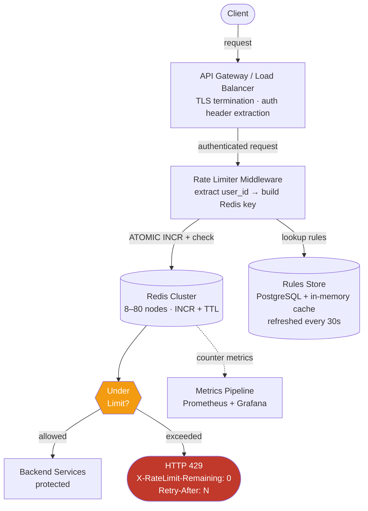

# Solution Guide: Distributed Rate Limiter

---

## Component Map

| Component | Technology | Role |
|-----------|------------|------|
| API Gateway / Middleware | Nginx plugin, Envoy filter, or in-process library | Intercepts every request; enforces limits |
| Counter Store | Redis Cluster (8–80 nodes) | Atomic INCR + TTL; sub-ms counter operations |
| Rules Store | PostgreSQL (source of truth) + local in-memory cache | Rate limit config; read every request, write rarely |
| Metrics Pipeline | Prometheus + Grafana | Per-user, per-endpoint limit hit rates |
| Admin API | REST service | CRUD for rate limit rules |
| Cache Refresh | Background poller (30s interval) per limiter node | Pulls updated rules from Postgres into local memory |

---

## Architecture Diagram



**Key insight on placement:** The rate limiter runs *before* the backend service but *after* auth. Running it before auth means we can only rate-limit by IP (coarse, easy to spoof). Running it after auth gives us the user ID — we can enforce per-tier limits accurately. The tradeoff: auth itself consumes latency budget. In practice, most systems extract a signed JWT at the gateway, validate it in microseconds, and pass `user_id` in an internal header so the rate limiter never hits a database for identity.

---

## Capacity Math

### Step 1: Peak request rate

```
10M DAU
× 10 calls/minute average
÷ 60 seconds
= 1.67M req/sec average

× 5 burst multiplier
= 8.3M req/sec peak
```

This is the throughput your rate limiter must handle. Round to **8M req/sec** for napkin math.

### Step 2: Redis nodes needed

```
Single Redis node: ~100K–200K INCR/sec (conservatively 100K)
8M req/sec ÷ 100K per node = 80 Redis nodes
```

With consistent hashing, each user's key routes to one shard deterministically — no cross-shard coordination needed. With modern Redis (7.x) cluster and faster hardware, you might get by with **8–16 nodes** at 500K–1M ops/sec each, but plan for 80 as your worst-case.

### Step 3: Storage for counters

```
Each active user: ~5 endpoints × 1 counter each
= 5 keys per user

10M active users × 5 keys × 160 bytes/key
= 8 GB total

With 5x burst users active simultaneously:
= 8 GB (Redis comfortably handles this on a single node's RAM)
```

50M DAU × 160 bytes/user = ~8 GB. Redis fits this in memory easily.

### Step 4: Latency budget

```
Total API SLA:          100ms p99
Auth + routing:          40ms
Backend service:         50ms
Rate limiter budget:      5ms remaining

Redis INCR (local DC):   1–3ms
Rules lookup (in-memory): <0.1ms
Response construction:    <0.5ms
Total rate limiter:       ~3–4ms  ✓
```

This validates that Redis-backed in-memory rules is the right stack. Any solution requiring a synchronous database read per request blows the latency budget.

---

## API Design

### Response Headers (all requests, not just rejected)

```http
HTTP/1.1 200 OK
X-RateLimit-Limit: 5000
X-RateLimit-Remaining: 4823
X-RateLimit-Reset: 1719532800
```

### Rejected Request

```http
HTTP/1.1 429 Too Many Requests
X-RateLimit-Limit: 5000
X-RateLimit-Remaining: 0
X-RateLimit-Reset: 1719532800
Retry-After: 47
Content-Type: application/json

{
  "error": "rate_limit_exceeded",
  "message": "You have exceeded your rate limit of 5000 requests per hour.",
  "limit": 5000,
  "reset_at": "2024-06-28T00:00:00Z",
  "retry_after_seconds": 47
}
```

**Header semantics:**
- `X-RateLimit-Limit` — total allowed in the window
- `X-RateLimit-Remaining` — how many are left *right now*
- `X-RateLimit-Reset` — Unix timestamp when the window resets (not a duration)
- `Retry-After` — seconds until the client *should* retry (RFC 7231); distinct from Reset because Reset is wall clock, Retry-After is relative duration

**Admin API:**

```
POST   /v1/rules                    Create a new rate limit rule
GET    /v1/rules/{id}               Get a rule
PUT    /v1/rules/{id}               Update a rule
DELETE /v1/rules/{id}               Delete a rule

POST   /v1/allowlist                Add a user/IP to allowlist
DELETE /v1/allowlist/{id}           Remove from allowlist
```

---

## Data Model

### Redis Key Structure

**Fixed Window Counter:**
```
Key:   rl:{user_id}:{endpoint}:{window_start_ts}
Value: integer (INCR)
TTL:   window size in seconds
Example: rl:usr_9182:POST/v1/charges:1719532800 = 47
```

**Sliding Window Log:**
```
Key:   rl:log:{user_id}:{endpoint}
Type:  Sorted Set (ZADD / ZRANGEBYSCORE)
Score: Unix timestamp (milliseconds)
Member: request UUID or timestamp
TTL:   window size (remove old entries with ZREMRANGEBYSCORE)
```

**Token Bucket:**
```
Key:   rl:bucket:{user_id}:{endpoint}
Type:  Hash
Fields:
  tokens        float   (current token count)
  last_refill   int     (Unix timestamp ms of last refill)
TTL:   set on last write; expire stale buckets
```

### Rules Store (PostgreSQL)

```sql
CREATE TABLE rate_limit_rules (
    id          UUID PRIMARY KEY DEFAULT gen_random_uuid(),
    tier        VARCHAR(20) NOT NULL,    -- 'free', 'pro', 'enterprise'
    endpoint    VARCHAR(255),            -- NULL = applies to all endpoints
    limit_count INT NOT NULL,
    window_secs INT NOT NULL,
    algorithm   VARCHAR(20) NOT NULL,    -- 'token_bucket', 'fixed_window', 'sliding_window'
    burst_count INT,                     -- for token bucket: max burst above steady rate
    is_hard     BOOLEAN DEFAULT TRUE,    -- hard=block; soft=allow with degraded priority
    created_at  TIMESTAMPTZ DEFAULT NOW(),
    updated_at  TIMESTAMPTZ DEFAULT NOW()
);

CREATE TABLE allowlist (
    id          UUID PRIMARY KEY DEFAULT gen_random_uuid(),
    entity_id   VARCHAR(255) NOT NULL,   -- user_id or IP CIDR
    entity_type VARCHAR(10) NOT NULL,    -- 'user' or 'ip'
    reason      TEXT,
    expires_at  TIMESTAMPTZ              -- NULL = permanent
);
```

---

## Key Design Decisions

### Decision 1: Algorithm Choice

There is no universally "best" algorithm. Choose based on your traffic pattern.

| Algorithm | Memory | Accuracy | Burst Handling | Latency | Use When |
|-----------|--------|----------|---------------|---------|----------|
| Fixed Window | Low (1 key) | Moderate (boundary spike) | Poor (2× burst at window edge) | Lowest | Counters are cheap; boundary spikes acceptable |
| Sliding Window Log | High (1 entry/request) | Exact | Good | Highest (range query) | Billing-critical; small request volumes |
| Sliding Window Counter | Low-Medium | Good (approx.) | Good | Low | Best all-around for most APIs |
| Token Bucket | Medium (2 fields) | Exact | Excellent (explicit burst capacity) | Low | APIs with legitimate burst patterns (uploads, batch jobs) |
| Leaky Bucket | Medium | Exact (smoothed) | N/A (smooths bursts) | Low | Output rate control; prevents downstream burst |

**Recommended default: Token Bucket** for a public API platform. Reason: legitimate clients (CI pipelines, batch jobs, mobile apps syncing after airplane mode) have bursty patterns. Token bucket allows bursting up to the bucket capacity while enforcing a steady refill rate. Stripe uses this approach (blog: "Scaling your API with rate limiters", 2017).

**Fixed window's boundary problem** (must know for interviews): A user allowed 100 req/minute can send 100 in the last second of minute 1 and 100 in the first second of minute 2 — 200 requests in 2 seconds, twice the intended rate. Sliding window eliminates this.

### Decision 2: Storage Tier

Rules and counters have opposite access patterns — they must live in separate stores.

| Store | Access Pattern | Latency Requirement | Right Tool |
|-------|---------------|-------------------|------------|
| Counters | Write on every request; 8M writes/sec | <3ms | Redis Cluster (in-memory, atomic INCR) |
| Rules | Read on every request, write rarely (100x/day) | <0.1ms | Local in-memory cache on each limiter node, sourced from Postgres |

**Why not store rules in Redis too?** You could, but it conflates two very different consistency models. Counters must be atomically incremented and need TTL. Rules need transactional updates (a rule change should be atomic across all fields) and audit history. Postgres gives you both. The local cache gives you the read speed.

Databricks published a postmortem (2023) where their single Redis node cracked under load for counters. They moved to in-memory counters on each service node and saw 10× tail latency improvement. For most companies, Redis Cluster is the right answer — but this illustrates that the *access pattern* of counters (write-heavy, atomic, short-lived) drives the storage choice.

### Decision 3: Atomic Operations

**The most common implementation bug:** Two-step check-then-act.

```python
# WRONG — race condition
count = redis.get(key)
if count < limit:
    redis.incr(key)  # Another request slipped in between these two lines
    forward_request()
else:
    reject_request()
```

Between the GET and the INCR, 50 other goroutines may have done the same thing. All 51 requests are allowed past a limit of 50.

**The fix: atomic increment with Lua script (runs atomically on Redis server):**

```lua
-- Lua script executed atomically via EVAL
local key = KEYS[1]
local limit = tonumber(ARGV[1])
local window = tonumber(ARGV[2])
local now = tonumber(ARGV[3])

local count = redis.call('INCR', key)
if count == 1 then
    -- First request in this window; set TTL
    redis.call('EXPIRE', key, window)
end

if count > limit then
    return {0, count, limit}  -- rejected, current count, limit
else
    return {1, count, limit}  -- allowed, current count, limit
end
```

This Lua script runs as a single atomic unit on the Redis server. No other command can interleave between the INCR and the EXPIRE. This is the correct implementation.

**Alternative: Redis transactions (MULTI/EXEC)** are optimistic — they watch a key and retry if it changed. Under high contention (which is exactly what rate limiting is), retry storms can amplify the problem. Lua scripts are strictly preferred.

### Decision 4: Fail-Open vs Fail-Closed

When the Redis counter store goes down, the rate limiter cannot check or increment any counter. You have two choices:

**Fail-open (allow all traffic):**
- Backend services receive all traffic unthrottled during the outage
- Pro: No false blocking of legitimate users; API remains available
- Con: An ongoing DDoS or abuse campaign gets through; backends may still cascade

**Fail-closed (block all traffic):**
- Return 429 or 503 to all requests during Redis outage
- Pro: Backends are protected; abuse cannot exploit the outage window
- Con: Legitimate users are blocked; violates API availability SLA

**The right answer depends on the business.** For most external APIs (Stripe, GitHub, OpenAI), fail-open is preferred — the risk of false-blocking paying customers outweighs the risk of a short outage. For internal security-critical services (auth, billing), fail-closed may be appropriate.

**A third option — local in-process counters as fallback:** Each rate limiter node keeps a local counter. Under Redis outage, enforce limits locally per node. Each node has ~1/N of global traffic (N nodes), so local limits are set to `global_limit / N`. This is approximate (a user can hit all N nodes and get N× the limit in the worst case), but it's a reasonable middle ground. Cloudflare's PoP-local approach is a production version of this — they accept per-PoP approximation because anycast routing means a given client IP almost always hits the same PoP (blog: "How we built rate limiting capable of scaling to millions of domains").

---

## Deep Dive: Token Bucket with Redis

```python
import redis
import time

REFILL_RATE = 100      # tokens per second (steady state)
BUCKET_SIZE = 500      # max burst: 500 tokens
COST_PER_REQUEST = 1   # tokens consumed per request

LUA_SCRIPT = """
local key = KEYS[1]
local refill_rate = tonumber(ARGV[1])
local bucket_size = tonumber(ARGV[2])
local cost = tonumber(ARGV[3])
local now = tonumber(ARGV[4])   -- current time in milliseconds

-- Load existing bucket state
local bucket = redis.call('HMGET', key, 'tokens', 'last_refill')
local tokens = tonumber(bucket[1]) or bucket_size
local last_refill = tonumber(bucket[2]) or now

-- Calculate tokens to add based on elapsed time
local elapsed_secs = (now - last_refill) / 1000.0
local new_tokens = math.min(bucket_size, tokens + elapsed_secs * refill_rate)

-- Attempt to consume
if new_tokens >= cost then
    new_tokens = new_tokens - cost
    redis.call('HMSET', key, 'tokens', new_tokens, 'last_refill', now)
    redis.call('EXPIRE', key, 3600)   -- expire stale buckets after 1 hour
    return {1, math.floor(new_tokens)}   -- allowed; remaining tokens
else
    redis.call('HMSET', key, 'tokens', new_tokens, 'last_refill', now)
    redis.call('EXPIRE', key, 3600)
    return {0, 0}   -- rejected; 0 remaining
end
"""

class TokenBucketRateLimiter:
    def __init__(self, redis_client: redis.Redis):
        self.redis = redis_client
        self.script = redis_client.register_script(LUA_SCRIPT)

    def is_allowed(self, user_id: str, endpoint: str,
                   limit: int, window_secs: int) -> tuple[bool, int]:
        key = f"rl:bucket:{user_id}:{endpoint}"
        refill_rate = limit / window_secs
        now_ms = int(time.time() * 1000)

        result = self.script(
            keys=[key],
            args=[refill_rate, limit, COST_PER_REQUEST, now_ms]
        )
        allowed = bool(result[0])
        remaining = int(result[1])
        return allowed, remaining
```

**Why register_script?** `register_script` uses `EVALSHA` — the script is uploaded once and executed by its SHA hash on subsequent calls. Avoids sending the full Lua script body with every request (saves ~200 bytes per call at 8M req/sec = significant bandwidth savings).

---

## Failure Modes

| Failure | Detection | Mitigation | Recovery |
|---------|-----------|-----------|---------|
| Redis node down | Health check, connection error | Failover to replica; if cluster: consistent hash reroutes | Redis Sentinel or Cluster auto-failover in ~30s |
| Redis cluster partition | Partial write failures, increased latency | Fail-open or local fallback counters | Partition heals; counters may be slightly off during split |
| Rules store (Postgres) down | Connection error on cache refresh | Continue serving from stale in-memory cache | Cache is valid for last 30s; degraded but functional |
| Rate limiter node crash | Load balancer health check | LB removes node from pool; traffic rerouts in <5s | Node restarts; Redis state preserved (no counter loss) |
| Clock skew between nodes | Window boundaries differ per node | Use Redis server time (`TIME` command) as reference clock, not local system time | N/A — Redis server is the single time authority |
| DDoS overwhelming Redis | Redis CPU saturates; latency spikes | Rate limiting Redis itself (irony); shed load; add replicas | Scale Redis cluster horizontally |
| Rule misconfiguration | Legitimate users hit 429 | Monitoring alert on 429 spike; admin rollback via Admin API | Update rule; propagates in ≤30s |

---

## What Strong Candidates Do Differently

1. **Lead with the failure mode, not the happy path.** Open with: "Before I design this, let me confirm what happens when the rate limiter itself fails — that's the most dangerous question." Interviewers remember candidates who flip the conversation.

2. **Derive storage separation from first principles.** Don't say "I'll use Redis for counters and Postgres for rules." Say: "Counters need atomic write on every request at 8M/sec — that rules out disk. Rules need transactional consistency and audit trail — that needs a relational store. These are incompatible requirements that force different stores."

3. **Call out the race condition proactively.** Before the interviewer asks: "A naive read-then-write has a race condition. We need atomic increment. Redis Lua script eliminates the interleave."

4. **Give real numbers with sources.** "Stripe uses token bucket with Redis. GitHub's limits are 60/hour unauthenticated, 5K/hour with a PAT, 15K/hour for Enterprise Cloud apps. Cloudflare does PoP-local counting across 330+ cities."

5. **Distinguish hard vs soft limits** and explain the use case for each. Hard = block immediately. Soft = allow the request but flag it for deprioritized processing, degraded quality of service, or logging.

6. **Discuss observability proactively.** "How do we know if the rate limiter is protecting us vs silently breaking legitimate users? We emit three metrics: requests allowed, requests rejected, and limit headroom (how close users are to their limit). An alert fires if rejection rate exceeds 5% for a given user tier without a known incident — that indicates possible misconfiguration."

---

## What Average Candidates Miss

1. **Race condition on counter update.** Most candidates describe "check the counter, then increment it." This is a bug in any concurrent system. The interviewer is specifically waiting for you to identify this.

2. **Fail-open vs fail-closed.** When asked "what happens when Redis goes down?" most candidates freeze or say "we handle the error." The interviewer wants to hear you name the tradeoff and make a deliberate choice.

3. **Rules and counters in the same store.** Candidates often propose one Redis instance for everything. Different access patterns (write-heavy vs read-heavy, atomic increment vs transactional update) demand different storage tiers.

4. **Clock skew between distributed nodes.** If each rate limiter node uses its local system clock to define window boundaries, users near a window boundary get inconsistently enforced limits. The fix: use Redis `TIME` command as the reference clock.

5. **No observability.** After designing the entire system, candidates forget that operations teams need to see what the rate limiter is doing. Which users are hitting limits? Is the platform under attack or is a customer misconfigured?

6. **Skipping the response contract.** Most candidates say "return 429" but never mention `X-RateLimit-Remaining`, `Retry-After`, or `X-RateLimit-Reset`. These are standard, expected, and a client that receives them can implement backoff — a client that doesn't gets confused and hammers the API harder.
