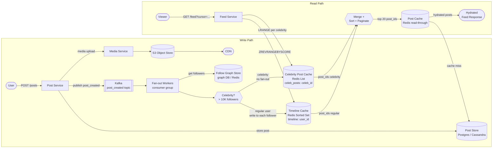

# Solution Guide: Social Feed

---

## Component Map

```
Component                   Role
─────────────────────────   ────────────────────────────────────────────────
Post Service                Validates and durably stores new posts
Fan-out Service             Reads follow graph, writes post IDs into timelines
Follow Graph Store          Bidirectional adjacency: who follows whom
Timeline Cache (Redis)      Precomputed sorted set of post IDs per user
Feed Service                Assembles feed at read time from cache + celebrity pull
Post Store (DB)             Source of truth for post content and metadata
Media CDN / Object Store    Images and video; post metadata contains URLs only
Message Queue (Kafka)       Decouples write path; absorbs fan-out spike
Celebrity Post Store        Recent posts from high-follower accounts; pulled at read time
```

---

## Architecture Diagram



---

## Full Capacity Math

### Write Path

```
Posts created per day:           10,000,000
Posts per second (average):      10,000,000 / 86,400 = 115.7 writes/sec
Posts per second (peak 10x):     ~1,157 writes/sec

Average followers per user:      500
Fan-out writes per post:         500 post_id inserts into Redis
Total fan-out writes/day:        10M posts × 500 followers = 5 billion Redis writes/day
Fan-out writes/sec (average):    5,000,000,000 / 86,400 = 57,870 writes/sec
Fan-out writes/sec (peak 5x):    ~289,000 writes/sec

Redis sorted set entry size:     ~16 bytes (8-byte score + 8-byte member)
Timeline entries per user:       200 (capped; trim on insert)
RAM per user timeline:           200 × 16 = 3,200 bytes ≈ 3.2 KB
RAM for 300M users:              300,000,000 × 3,200 = 960 GB ≈ 1 TB
```

**Compare to real Twitter data:** Twitter's Redis fleet in 2013 was ~10,000 instances, 105 TB RAM, serving 39M QPS. At 300M DAU that scales proportionally. Source: High Scalability, "How Twitter Stores 250 Million Tweets a Day Using MySQL", 2013.

### Read Path

```
DAU:                             300,000,000
Feed loads per user per day:     10
Total feed loads per day:        3,000,000,000
Feed loads per second (average): 3,000,000,000 / 86,400 = 34,722 reads/sec
Feed loads per second (peak 5x): ~173,600 reads/sec

Read:Write ratio (feed reads vs posts):
  34,722 reads/sec : 115 writes/sec = ~300:1

Note: Twitter reported 300,000 timeline QPS vs 6,000 write QPS = 50:1 at their scale.
      This is consistent — our calculation uses feed page loads, not raw Redis ops.
      Each feed load triggers ~3 Redis calls (timeline + celebrity fetch + hydrate).
      Effective Redis QPS: 34,722 × 3 = ~104,000 QPS (well within Redis capacity).
```

### The Celebrity Problem (Selena Gomez Math)

```
Selena Gomez Instagram followers:  405,000,000 (Dexerto, 2023+)
Cristiano Ronaldo followers:       650,000,000+ (Instagram, 2024-2026)

If we naively fan-out-on-write for Selena Gomez:
  405,000,000 Redis ZADD operations
  At 10,000 writes/sec (Redis single thread):
    405,000,000 / 10,000 = 40,500 seconds = 11.25 HOURS to complete fan-out

She posts 10 times per day.
  New post every 2.4 hours.
  Fan-out never finishes before next post.
  System is permanently behind → timeline cache is permanently stale.

Conclusion: fan-out-on-write cannot be used for celebrity accounts.
```

---

## API Design

### Create Post

```
POST /v1/posts
Authorization: Bearer <token>
Content-Type: application/json

{
  "text": "string (max 280 chars)",
  "media_ids": ["string"],       // optional; pre-uploaded media IDs
  "reply_to_post_id": "string"   // optional; for replies/threads
}

Response 201:
{
  "post_id": "string",
  "author_id": "string",
  "created_at": "ISO8601",
  "text": "string"
}
```

### Get Feed

```
GET /v1/feed?limit=20&cursor=<opaque_cursor>
Authorization: Bearer <token>

Response 200:
{
  "posts": [
    {
      "post_id": "string",
      "author_id": "string",
      "author_handle": "string",
      "author_display_name": "string",
      "text": "string",
      "media_urls": ["string"],
      "created_at": "ISO8601",
      "like_count": 12345,
      "reply_count": 67
    }
  ],
  "next_cursor": "string",     // null if no more results
  "has_more": true
}
```

**Cursor design:** The cursor encodes the timestamp of the oldest post in the current page. On the next request, the Feed Service fetches posts older than that timestamp. This is stable under concurrent inserts — offset-based pagination breaks when new posts are inserted at the front.

### Follow / Unfollow

```
POST   /v1/users/{user_id}/follow     → 204 No Content
DELETE /v1/users/{user_id}/follow     → 204 No Content
GET    /v1/users/{user_id}/followers  → paginated list
GET    /v1/users/{user_id}/following  → paginated list
```

---

## Data Model

### Post Store (Postgres or Cassandra)

```sql
-- Postgres schema (for services with < 500M posts total; shard by user_id range at scale)
CREATE TABLE posts (
    post_id     UUID        PRIMARY KEY DEFAULT gen_random_uuid(),
    author_id   UUID        NOT NULL,
    text        VARCHAR(280),
    media_ids   UUID[],
    reply_to    UUID,                         -- null if original post
    created_at  TIMESTAMPTZ NOT NULL DEFAULT NOW(),
    deleted_at  TIMESTAMPTZ,                  -- soft delete
    like_count  INT         DEFAULT 0,        -- denormalized counter
    reply_count INT         DEFAULT 0
);

CREATE INDEX idx_posts_author_created ON posts (author_id, created_at DESC);
-- Index to serve profile pages + celebrity post lookups
```

### Follow Graph Store

Two options with different trade-offs:

**Option A: Postgres (simple, works to ~500M follow relationships)**
```sql
CREATE TABLE follows (
    follower_id   UUID NOT NULL,
    followee_id   UUID NOT NULL,
    created_at    TIMESTAMPTZ NOT NULL DEFAULT NOW(),
    PRIMARY KEY (follower_id, followee_id)
);

CREATE INDEX idx_follows_followee ON follows (followee_id);
-- Lookup: "who follows user X" — needed for fan-out
-- Lookup: "who does user X follow" — needed for celebrity merge at read time
```

**Option B: Redis hash set (faster fan-out lookup)**
```
SMEMBERS followers:{user_id}      → set of follower_ids
SMEMBERS following:{user_id}      → set of followee_ids
```
Trade-off: Redis is faster but requires synchronization with durable store. Use Redis as a cache over Postgres follows table.

### Timeline Cache (Redis Sorted Set)

```
Key:    timeline:{user_id}
Type:   Sorted Set
Score:  Unix timestamp (float, millisecond precision)
Member: post_id (UUID as string)

Example:
  ZADD timeline:user-abc 1719532800.000 "post-xyz"
  ZADD timeline:user-abc 1719529200.000 "post-def"
  ZREVRANGEBYSCORE timeline:user-abc +inf -inf LIMIT 0 20
  → returns last 20 post IDs in reverse chronological order

Eviction policy: LRU on key level; cap each timeline to 200 entries.
  ZREMRANGEBYRANK timeline:{user_id} 0 -(MAX_ENTRIES+1)
  (trim after every insert — O(log N) per insertion)
```

### Celebrity Post Cache (Redis List)

```
Key:    celeb_posts:{user_id}
Type:   List (LPUSH + LTRIM)
Entries: post_ids of recent posts (last 50)

LPUSH celeb_posts:{celebrity_id} {post_id}
LTRIM celeb_posts:{celebrity_id} 0 49
LRANGE celeb_posts:{celebrity_id} 0 49
```

---

## Key Design Decisions

### Decision 1: Fan-out-on-Write vs Fan-out-on-Read

The core architectural decision of the entire problem.

**Fan-out-on-write (push model):**
- When a post is created, immediately write the post_id into every follower's timeline cache.
- Read is instant: just fetch the precomputed sorted set.
- Problem: write amplification. A user with 500 followers triggers 500 Redis writes. A user with 50M followers triggers 50M writes — this is catastrophic.
- Works well for: users with small follower counts.

**Fan-out-on-read (pull model):**
- When a user loads their feed, query all followees for their recent posts and merge in real time.
- No write amplification at post creation.
- Problem: read is expensive. To build a feed for a user who follows 500 accounts, you need 500 database queries per feed load. At 35,000 feed loads/sec, that is 17.5M DB queries/sec.
- Works well for: celebrities (few reads of their posts relative to their follower count).

**The decision:** Neither alone scales. Use a hybrid.

### Decision 2: The Hybrid Model (the answer)

**Regular users (< threshold T followers): fan-out-on-write.**
- A post from a regular user gets written into each follower's precomputed timeline.
- Feed reads are O(1): just fetch the sorted set.

**Celebrities (> threshold T followers): fan-out-on-read.**
- A celebrity's post goes into `celeb_posts:{celebrity_id}` only.
- At read time, the Feed Service identifies which celebrities the requesting user follows, fetches their recent posts, and merges with the precomputed timeline.
- Celebrity list per user changes rarely (follow/unfollow); safe to cache per user.

**Celebrity threshold T:** Commonly set at 10,000–100,000 followers. The right number depends on your fan-out worker capacity. At 10K followers, fan-out is completed in milliseconds. At 50K, a few seconds. At 1M, minutes. Instagram's internal threshold is reportedly around 10,000–50,000. Choose 10K as a safe default; make it a runtime-configurable parameter.

### Decision 3: Timeline Cache Structure (Redis Sorted Set)

A Redis sorted set is the right data structure because:
- `ZADD` is O(log N) — fast per insert.
- `ZREVRANGEBYSCORE` with a cursor is O(log N + M) where M is the page size — fast per read.
- Score = timestamp enables natural time-based pagination.
- TRIM after insert keeps memory bounded.
- Supports cursor-based pagination by using the timestamp as the cursor.

Alternative considered: Redis list. Rejected because: no efficient range-by-timestamp; re-insertion to maintain sorted order is O(N).

### Decision 4: Chronological vs Algorithmic Ranking

The solution above gives reverse-chronological feed, which is simpler and the default for most products. Algorithmic ranking (Instagram's Explore, Twitter/X's "For You") requires:
- A ranking service that scores each candidate post by engagement likelihood.
- A larger candidate pool fetched from the cache (e.g., 200 candidates, ranked to 20).
- ML inference latency budget — the ranking must complete within the 200ms SLA.

For the interview, design chronological first, then offer algorithmic as an extension if time permits.

---

## Deep Dive: The Hybrid Fan-out

### What happens when a regular user posts?

```
1. User POSTs /v1/posts → Post Service
2. Post Service writes post to Post Store (Postgres).
3. Post Service publishes { post_id, author_id, timestamp } to Kafka topic: post_created
4. Fan-out Workers consume from Kafka:
   a. Query Follow Graph: SMEMBERS followers:{author_id}  → [follower_1, follower_2, ... follower_500]
   b. Check each follower:
      - Is follower active? (opened app in last 30 days) → skip inactive users
      - Is follower's timeline cache populated? (key exists in Redis) → only push to warm caches
   c. For each qualifying follower_id:
      ZADD timeline:{follower_id} {timestamp} {post_id}
      ZREMRANGEBYRANK timeline:{follower_id} 0 -(MAX_ENTRIES+1)  // trim to cap
5. Fan-out complete. Took: ~500 Redis writes × 0.1ms = ~50ms total.
```

### What happens when Selena Gomez posts?

```
1. Selena POSTs /v1/posts → Post Service
2. Post Service writes post to Post Store.
3. Post Service publishes to Kafka.
4. Fan-out Worker consumes from Kafka:
   a. Checks: follower count of author = 405,000,000 → ABOVE THRESHOLD (10K)
   b. Does NOT fan-out to individual follower timelines.
   c. Instead: LPUSH celeb_posts:{selena_id} {post_id}
              LTRIM celeb_posts:{selena_id} 0 49
5. Done. Two Redis operations total. Takes < 1ms.
```

### What happens when a user loads their feed?

```
1. User GETs /v1/feed?cursor=...  → Feed Service
2. Feed Service:
   a. Fetch precomputed timeline:
      ZREVRANGEBYSCORE timeline:{user_id} {cursor_ts} -inf LIMIT 0 50
      → 50 post IDs from regular users they follow

   b. Identify followed celebrities:
      SMEMBERS following_celebrities:{user_id}  // cached separately: set of celebrity_ids this user follows
      (populated/invalidated on follow/unfollow; typically 0-10 celebrities per user)

   c. For each followed celebrity C:
      LRANGE celeb_posts:{C} 0 49
      → recent 50 post IDs from C

   d. MERGE: combine precomputed list + celebrity lists
      Sort by timestamp (in-memory, O(N log N) where N ≤ 500 entries — trivially fast)
      Apply cursor filter: discard posts with timestamp >= cursor_ts

   e. Paginate: take first 20 results.

   f. HYDRATE: MGET post:{post_id} for all 20 post IDs
      (Redis read-through cache over Post Store; cache miss = DB fetch, populate cache)

3. Return 20 hydrated posts. Total time: ~10-30ms for Redis ops + ~5-20ms for hydration.
   Well within 200ms SLA.
```

### The merge step is critical

Many candidates forget step (d). They explain the hybrid model correctly but when asked "how does Selena Gomez's post appear in your timeline?" they cannot explain the merge. Without the merge step, celebrity posts simply never appear.

The merge also handles a subtle bug: if you apply the cursor incorrectly (e.g., using an offset instead of a timestamp), re-fetching after a new celebrity post is inserted can return duplicates or skip posts. Timestamp-based cursor correctly handles this.

---

## Failure Modes

| Failure | Impact | Mitigation |
|---------|--------|------------|
| Redis timeline cache miss | Feed load falls through to DB; slower (100–500ms), not broken | Read-through cache; warm new followers on first load |
| Redis node failure | ~1/N of timelines unavailable | Redis cluster with replicas; graceful degradation to DB |
| Fan-out worker backlog | Timeline updates delayed | Kafka consumer group with horizontal scaling; monitor consumer lag |
| Celebrity cache miss | Celebrity posts missing from feed until next fetch | Short TTL (60s) + background refresh; acceptable — eventual consistency |
| Follow graph unavailable | Fan-out stalls; feeds go stale | Fan-out retries with exponential backoff; timelines remain readable (stale but not broken) |
| Post Store unavailable | Post creation fails; feed hydration fails | Write path: circuit breaker + error to client. Read path: serve from cache with degraded hydration |
| Kafka topic retention exhausted | Fan-out workers lose events | Sufficient retention (24h); fan-out workers checkpoint; backfill job for recovery |
| Large account fan-out threshold mis-set | Misclassified account bursts fan-out workers | Threshold as runtime config; fan-out workers self-shed by skipping accounts above real-time computed threshold |

---

## What Strong Candidates Do Differently

1. **Define the celebrity threshold explicitly.** Not "some users are celebrities" — say "> 10,000 followers" and explain why that number. The number is the design.

2. **Show the merge step on the whiteboard.** Draw the precomputed timeline and celebrity feeds separately, then draw the merge arrow. Name it "merge step." Many candidates understand the concept but never draw the critical step that makes the hybrid work.

3. **Inactive user optimization.** Point out proactively: "I won't fan-out to users who haven't opened the app in 30 days. That could be 40% of followers. Major write reduction." This is an L5+ signal — operational awareness without prompting.

4. **Cursor-based pagination.** Offer it unprompted and explain why offset pagination breaks under concurrent inserts. Interviewers at Meta and Twitter note this as a differentiator.

5. **Back-of-envelope math drives the architecture.** The candidate who derives the 405M × 10K writes/sec = 11 hours number is the candidate who proves they understand why the hybrid model is mandatory, not just a preference.

6. **Post deletion.** Handle it: soft delete in Post Store, set deleted_at. Feed hydration filters out deleted posts. No need to remove from timeline caches — hydration is the filter gate.

---

## What Average Candidates Miss

1. **Not separating feed generation from feed hydration.** The timeline cache stores post IDs only. Post content is fetched separately. Conflating the two leads to bloated cache entries and incorrect reasoning about cache size.

2. **"Eventual consistency is fine" without explaining what fine means.** Acceptable delay is 5 seconds, not 5 minutes. There's a difference and interviewers will probe it.

3. **Forgetting that unfollows must invalidate the precomputed timeline.** If User A unfollows User B, User B's post_ids sitting in User A's timeline cache should be removed. Options: lazy removal (filter at read time), eager removal (unfollow triggers cache cleanup). Candidates often handle follow but forget unfollow.

4. **Single database for the post table.** At 10M posts/day × 365 days = 3.65B posts/year, a single Postgres instance will not survive unsharded. Must shard by author_id or use a distributed store like Cassandra from day one.

5. **No mention of fan-out worker scaling.** Kafka consumer groups allow horizontal scaling of fan-out workers. This is the lever you pull when fan-out latency grows — not "make Redis faster."

6. **Ignoring read replicas.** Post hydration hits the post store. Read replicas (Postgres streaming replication) handle this. Candidates who route all reads to primary are misdesigning under the stated read load.
