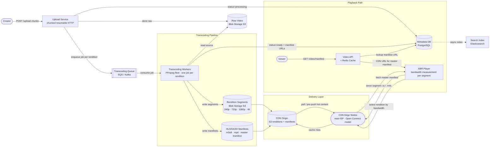

# Solution Guide — Video Streaming (YouTube / Netflix)

---

## Component Map

| Component | Role | Technology Examples |
|-----------|------|---------------------|
| Upload Service | Accepts chunked HTTP uploads, stores raw video to blob, enqueues job | Go / Java service; nginx for chunked HTTP |
| Blob Storage | Durable object store for raw + transcoded video | S3, GCS, Azure Blob |
| Transcoding Queue | Durable, ordered job queue between upload and workers | SQS, Kafka, RabbitMQ |
| Transcoding Workers | Stateless workers; read raw, write renditions | FFmpeg fleet, GPU instances |
| Metadata DB | Structured storage for video records, job status, manifests | PostgreSQL + read replicas |
| Metadata Cache | Reduce DB reads on hot video metadata | Redis / Memcached |
| CDN | Globally distributed edge cache for chunks + manifests | Open Connect (Netflix), Google CDN (YouTube), CloudFront |
| Video API | Serves manifest URLs, resolves video IDs, handles auth | REST/gRPC service |
| Watch History Service | Per-user resume position | Cassandra (write-heavy, key-value) |
| Search Index | Full-text search on video metadata | Elasticsearch |

---

## Architecture Diagram



---

## Full Capacity Math

### Upload Storage

```
Upload rate:     500 hours of video / minute
Source size:     300 MB per hour of 1080p source
                 ────────────────────────────────
Raw ingest:      500 × 300 MB = 150,000 MB/min = 150 GB/min
Per day raw:     150 GB × 60 × 24 = 216,000 GB/day ≈ 216 TB/day

Transcoding multiplier:
  10 renditions × average 50% compression vs source
  → 10 × 0.5 = 5× storage amplification from transcoding

Transcoded storage per day: 216 TB × 5 = 1,080 TB/day ≈ 1.08 PB/day
Total storage added per day: 216 TB (raw) + 1,080 TB (renditions) ≈ 1.3 PB/day

At 1 year: ~475 PB total. At 5 years with growth: multi-exabyte.
This is why YouTube and Netflix use object storage with cold tiering.
```

### Playback Bandwidth

```
DAU:              2 billion users
Watch session:    30 min/day average
Streaming rate:   2.5 Mbps average (mixed quality)

Total watch time per day:
  2B × 30 min = 60 billion minutes = 3.6 trillion seconds

Total egress:
  3.6 × 10^12 s × 2.5 Mbps = 9 × 10^12 Mb = 9,000 Pb/day ≈ 1.125 PB/day

Peak factor (assuming 3× peak):
  Peak egress ≈ 3.375 PB/day → ~39 Gbps sustained, ~120 Gbps peak

CDN servers needed:
  Each Open Connect Appliance: 100 Gbps
  120 Gbps peak ÷ 100 Gbps = ~1.2 servers just for peak egress
  But this is global; distribute across 3,000+ PoPs.
  Real answer: Netflix has 19,000+ OCA units across 1,500+ ISP locations.
```

### Transcoding Compute

```
Upload rate:             500 hours/min
Transcoding ratio:       ~1× realtime for 1080p on a modern encoder
                         (FFmpeg on a 16-core server ≈ 4–6× realtime for H.264)
Renditions per video:    10

Total encoding work:     500 hr/min × 10 renditions = 5,000 "encoding-hours"/min
At 5× realtime speed:    need 5,000 / 5 = 1,000 concurrent encoder-hours/min
                         ≈ 1,000 server-equivalents just for encoding

Reality check: YouTube uses a mix of CPUs, custom ASICs (like Google's VCUs —
Video Coding Units), and cloud burst capacity.
```

---

## API Design

### Resumable Upload — Initiate

```
POST /v1/uploads
Authorization: Bearer {token}
Content-Type: application/json

{
  "title": "My Great Film",
  "file_size_bytes": 5368709120,
  "mime_type": "video/mp4",
  "checksum_sha256": "abc123..."
}

Response 200:
{
  "upload_id": "upl_7xKm2pQ9",
  "upload_url": "https://upload.example.com/v1/uploads/upl_7xKm2pQ9",
  "chunk_size_bytes": 10485760,
  "expires_at": "2026-06-29T00:00:00Z"
}
```

### Resumable Upload — Send Chunk

```
PUT /v1/uploads/{upload_id}
Content-Range: bytes 0-10485759/5368709120
Content-Type: application/octet-stream

<binary chunk data>

Response 308 Resume Incomplete:
{
  "received_bytes": 10485760
}

Final chunk response 200:
{
  "video_id": "vid_9aRk7vN3",
  "status": "processing"
}
```

### Poll Processing Status

```
GET /v1/videos/{video_id}/status

Response 200:
{
  "video_id": "vid_9aRk7vN3",
  "status": "processing",           // queued | processing | ready | failed
  "progress_pct": 42,
  "available_renditions": ["240p", "360p"],
  "eta_seconds": 180
}
```

### Fetch Manifest (Playback)

```
GET /v1/videos/{video_id}/manifest?format=hls

Response 200:
{
  "video_id": "vid_9aRk7vN3",
  "manifest_url": "https://cdn.example.com/vid_9aRk7vN3/master.m3u8",
  "duration_seconds": 3612,
  "available_renditions": ["240p", "360p", "480p", "720p", "1080p", "4k"]
}
```

### Resume Position

```
GET  /v1/users/me/watch-history/{video_id}
POST /v1/users/me/watch-history/{video_id}
     Body: { "position_seconds": 742, "device_id": "dev_abc" }
```

---

## Data Model

### videos table (PostgreSQL)

```sql
CREATE TABLE videos (
  video_id        UUID PRIMARY KEY DEFAULT gen_random_uuid(),
  creator_id      UUID NOT NULL REFERENCES users(user_id),
  title           TEXT NOT NULL,
  description     TEXT,
  status          TEXT NOT NULL DEFAULT 'uploading',
    -- uploading | queued | processing | ready | failed | deleted
  upload_id       TEXT,                    -- links to resumable upload session
  source_blob_key TEXT,                    -- path in blob storage
  duration_secs   INTEGER,
  file_size_bytes BIGINT,
  checksum_sha256 TEXT,
  master_manifest_url TEXT,                -- set once transcoding completes
  created_at      TIMESTAMPTZ NOT NULL DEFAULT now(),
  published_at    TIMESTAMPTZ,
  updated_at      TIMESTAMPTZ NOT NULL DEFAULT now()
);

CREATE INDEX ON videos(creator_id, created_at DESC);
CREATE INDEX ON videos(status) WHERE status IN ('queued','processing');
```

### transcoding_jobs table (PostgreSQL)

```sql
CREATE TABLE transcoding_jobs (
  job_id          UUID PRIMARY KEY DEFAULT gen_random_uuid(),
  video_id        UUID NOT NULL REFERENCES videos(video_id),
  rendition       TEXT NOT NULL,     -- '1080p', '720p', etc.
  status          TEXT NOT NULL DEFAULT 'queued',
    -- queued | running | done | failed
  worker_id       TEXT,
  attempt_count   INTEGER NOT NULL DEFAULT 0,
  last_error      TEXT,
  source_blob_key TEXT NOT NULL,
  output_blob_prefix TEXT,           -- prefix where segments are stored
  manifest_url    TEXT,
  started_at      TIMESTAMPTZ,
  completed_at    TIMESTAMPTZ,
  created_at      TIMESTAMPTZ NOT NULL DEFAULT now()
);

CREATE INDEX ON transcoding_jobs(video_id, rendition);
CREATE INDEX ON transcoding_jobs(status) WHERE status IN ('queued','running');
```

### chunk_manifests (stored as files in blob, not in DB)

```
vid_9aRk7vN3/
├── master.m3u8                  ← master HLS manifest
├── 1080p/
│   ├── playlist.m3u8            ← rendition playlist
│   ├── seg_000.ts
│   ├── seg_001.ts
│   └── ...
├── 720p/
│   └── ...
└── 240p/
    └── ...
```

### watch_history (Cassandra — high write throughput, key-value access)

```
PRIMARY KEY: (user_id, video_id)

Columns:
  position_seconds    INT
  device_id           TEXT
  last_watched_at     TIMESTAMP
  completed           BOOLEAN
```

---

## Key Design Decisions

### 1. Transcoding Pipeline: Synchronous vs Asynchronous

**Rejected: Synchronous transcoding.** If transcoding runs synchronously inside the upload request handler, the upload HTTP connection must stay open for 10–30+ minutes. This ties up a thread, prevents retries, and fails on any network interruption. A candidate who says "after the user uploads, we transcode and then respond with the video URL" will fail this interview.

**Chosen: Async queue-based transcoding.**

The upload service does three things: accept chunks, assemble the raw file in blob storage, and publish a job to the transcoding queue. It responds immediately with `status: processing`. Workers pull from the queue independently. If a worker crashes mid-job, the message becomes visible again in SQS (visibility timeout) and another worker picks it up. This is the only design that handles failures gracefully at scale.

Idempotency: jobs are keyed by `(video_id, rendition)`. A re-run overwrites the output blob prefix — safe because blob writes are atomic at the object level. The `transcoding_jobs` table tracks per-rendition status, so partial failures (e.g., 4K encoding fails but 1080p succeeds) surface specific renditions as failed, not the entire video.

### 2. ABR: HLS vs DASH

Both HLS and DASH are adaptive bitrate streaming protocols. Both segment video into 2–10 second chunks. Both use a manifest file to describe available renditions. The key differences:

| Property | HLS | DASH |
|----------|-----|------|
| Origin | Apple (2009) | MPEG standard (2012) |
| Segment format | MPEG-TS (.ts) or fMP4 | fMP4 (.m4s) |
| Manifest format | M3U8 (text) | MPD (XML) |
| DRM | FairPlay (native), others via EME | Any via EME |
| iOS/Safari native | Yes | No (requires MSE polyfill) |
| Industry adoption | YouTube, Netflix, Twitch | Netflix (DASH on non-Apple), Amazon Prime |

**Netflix uses DASH on non-Apple devices and HLS on Apple devices.** YouTube uses HLS for broad compatibility. For a senior-level answer: both are acceptable; the key insight is that *choosing an adaptive protocol is non-negotiable* — serving a single fixed-bitrate stream at 2B-user scale would cause constant buffering.

DASH reduces rebuffering by ~30% on mobile compared to non-adaptive streaming (VdoCipher, 2024), because the ABR algorithm switches to a lower bitrate rendition within one segment interval (~4 seconds) when bandwidth drops.

### 3. CDN Strategy: Push vs Pull, and ISP Co-location

**Pull CDN (standard):** Edge serves chunk → if cache miss, pulls from origin. Simple to operate; cold-start latency on first request. Works for long-tail content.

**Push CDN (for hot content):** Before a video goes live, pre-push the top renditions to all edge nodes. Eliminates cold-start for popular content. Netflix uses this for new releases: before a major title drops, they pre-position content at Open Connect Appliances across all ISPs.

**ISP Co-location (the Netflix insight):** Paying AWS egress rates at Netflix's scale is economically untenable. Netflix operates Open Connect Appliances — purpose-built servers that Netflix ships to ISP data centers and operates within the ISP's network. The ISP benefits from reduced peering costs; Netflix benefits from near-zero egress cost and last-mile latency. 95% of Netflix traffic is served this way. A senior candidate who says "we'll use CloudFront" without mentioning ISP co-location as a cost optimization at scale is missing a key architectural insight.

Google's global CDN for YouTube uses 3,000+ PoPs (VdoCipher, 2024), similarly embedded at ISP level.

### 4. Resumable Uploads

A 50 GB upload over a mobile connection will be interrupted. A system that restarts the entire upload on interruption is unusable for creators.

**Protocol: resumable multipart upload** (similar to S3 multipart upload or Google Resumable Upload API):

1. Client initiates: `POST /uploads` → receives `upload_id` + `chunk_size`
2. Client sends chunks: `PUT /uploads/{upload_id}` with `Content-Range` header
3. Server acknowledges: returns bytes received so far
4. On reconnect: client queries `GET /uploads/{upload_id}` → gets last confirmed byte offset → resumes from there
5. On completion: all chunks assembled, job enqueued

State is stored server-side keyed by `upload_id`. Chunks are written to blob storage as they arrive — the upload service never holds the full file in memory.

### 5. Per-Title Encoding (Advanced: Netflix Innovation)

Traditional encoding used a single bitrate ladder (e.g., 1080p = always 4 Mbps). This wastes bandwidth on simple content (a black-and-white interview doesn't need 4 Mbps at 1080p) and underserves complex content (a fast-moving action sequence at 4 Mbps looks blocky).

Netflix's per-title encoding (debuted December 2015 with PSNR, switched to VMAF metric in June 2016) analyzes each title's visual complexity and computes an optimal bitrate ladder for that specific content. A simple cartoon can look identical to 4 Mbps at just 0.5 Mbps. A high-action blockbuster needs 6 Mbps to look the same.

Result: ~20% average bitrate reduction across the Netflix catalog (Netflix TechBlog), which at 280 million subscribers translates directly to bandwidth cost savings in the hundreds of millions of dollars annually.

Netflix later extended this to per-scene encoding: different scenes within a movie get different bitrate targets. A dark, static scene gets a low bitrate; an explosion scene gets a high bitrate. This is done by pre-segmenting the video by scene complexity before encoding.

---

## Deep Dive: The Transcoding Pipeline

When a creator uploads a 2-hour 4K movie, here is what happens step by step:

**Step 1 — Chunked ingest.**
The upload service receives the file in 10 MB HTTP chunks. Each chunk is written directly to blob storage under a temporary key like `uploads/upl_7xKm2pQ9/part_{N}`. The upload service never buffers the full file in RAM. On completion, it triggers an S3 multipart-complete equivalent to assemble parts into a single object: `raw/vid_9aRk7vN3/source.mp4`.

**Step 2 — Job creation.**
The upload service writes a `transcoding_jobs` row for each target rendition (10 renditions → 10 rows) with status `queued`. It publishes one message per rendition to the transcoding queue: `{ "job_id": "...", "video_id": "...", "rendition": "1080p", "source_blob_key": "raw/vid_9aRk7vN3/source.mp4" }`.

**Step 3 — Worker pickup.**
Transcoding workers run in a worker pool (auto-scaling group). Each worker pulls one message at a time with a visibility timeout of 30 minutes (a 2-hour video at 4K can take 20+ minutes to encode even at 5× realtime). The worker writes `status = running`, `worker_id = {self}` to `transcoding_jobs`.

**Step 4 — Encode.**
The worker streams the raw source from blob storage (does not download the full file first — streams it through FFmpeg). FFmpeg produces MPEG-TS segments of 4 seconds each, writing them incrementally to blob storage: `renditions/vid_9aRk7vN3/1080p/seg_{N}.ts`.

**Step 5 — Manifest generation.**
After all segments are written, the worker generates:
- Rendition playlist: `renditions/vid_9aRk7vN3/1080p/playlist.m3u8` listing all segment URLs with their durations
- After all renditions complete, the orchestrator (or a separate step) generates the master manifest: `renditions/vid_9aRk7vN3/master.m3u8` listing all rendition playlists with their bandwidth declarations

**Step 6 — Status update.**
Worker marks `transcoding_jobs` row as `done` and updates the `videos` table. When all renditions are done, `videos.status` → `ready`, `videos.master_manifest_url` → CDN URL of master manifest.

**Step 7 — CDN pre-positioning.**
For popular channels (> N subscribers), a post-completion hook triggers CDN pre-push to top PoPs. For all other videos, CDN pull-on-miss handles the first viewers.

**Failure Recovery:**
- Worker crash mid-encode: SQS visibility timeout expires → message re-enqueued → different worker picks it up → idempotent write (overwrites partial segments).
- Partial rendition failure: Only the failed rendition job is retried, not the full set. The video can be marked `partially_ready` with available renditions listed.
- Blob write failure: Worker retries with exponential backoff before marking job failed. Dead-letter queue receives jobs that fail after 3 attempts → manual inspection.

Netflix encodes ~120 streams per title: 10+ resolutions × multiple bitrates × audio tracks × subtitles (techinterview.org, 2024). For a 2-hour film, that is a significant compute job — distributed across a worker fleet, not run sequentially on a single machine.

---

## Failure Modes

| Failure | Detection | Impact | Recovery |
|---------|-----------|--------|----------|
| Transcoding worker crash | Job visibility timeout expires; heartbeat missed | Rendition not available until retry | SQS re-enqueues; new worker picks up; idempotent blob writes |
| CDN edge node failure | DNS health check fails; edge removed from rotation | Traffic fails over to next-nearest PoP; latency increases | Anycast routing; CDN provider handles automatically |
| Upload interrupted mid-way | Client receives TCP reset or HTTP error | Upload partially written to blob | Resumable upload protocol; client queries last-received-byte, resumes from there |
| Blob storage unavailable | Object writes return 5xx | Upload fails; transcoding stalls | Retries with backoff; client-side queue; 11-nine durability means this is rare |
| Metadata DB overload | Query latency spikes; connection pool exhausted | Manifest lookups slow; 5xx to viewers | Read replicas; Redis cache in front; circuit breaker on fallback to stale manifest |
| Transcoding job stuck (infinite loop / encoding bug) | Job exceeds max processing time threshold | One video never becomes ready | Job timeout kills worker; DLQ + alert; manual retry after fix |

---

## What Strong Candidates Do Differently

1. **Acknowledge the CDN is not built from scratch.** Netflix Open Connect, Google CDN, CloudFront exist precisely because CDN infrastructure is a solved, capital-intensive problem. A strong candidate says: "I'd use an existing CDN — either a managed service like CloudFront or, at Netflix scale, an ISP co-location model like Open Connect to eliminate egress costs." A weak candidate draws a CDN from scratch without acknowledging the real-world alternative.

2. **Explain ABR at the player level.** The ABR algorithm is not magic. It runs on the client. The player downloads one segment, measures the download speed (bytes received / time elapsed), compares to the bitrate required for each rendition, and selects the highest rendition whose bitrate fits within ~80% of measured bandwidth (with hysteresis to avoid thrashing). A strong candidate explains this loop — not just "we use adaptive bitrate."

3. **Design the transcoding pipeline as a DAG of async tasks, not a monolith.** For a 4K movie, you don't run all renditions in serial on one worker. You fan out: one message per rendition, competing workers. Strong candidates draw this fan-out explicitly.

4. **Name the failure mode for transcoding.** "What happens if the worker crashes halfway through encoding 4K?" is a canonical interviewer probe. Strong answer: visibility timeout re-enqueues the job; idempotent writes mean re-running from scratch is safe; per-rendition granularity means only the failed rendition retries.

5. **Mention per-title encoding as a real optimization.** It shows awareness of how the industry actually operates, not just textbook ABR.

6. **Derive the egress economics.** At 2B DAU × 30 min × 2.5 Mbps, the egress cost at AWS public rates would be catastrophic. Mentioning ISP co-location as the cost solution signals business-architecture thinking.

---

## What Average Candidates Miss

- Designing synchronous transcoding (blocks upload thread for 20+ minutes)
- Not mentioning adaptive bitrate at all — when the interviewer asks "user drops from LTE to 2G, what happens?" the candidate has no answer
- Using a CDN but not explaining pull vs push or ISP co-location
- Not handling resumable uploads — treating a 50 GB upload as a single HTTP POST
- Forgetting the transcoding failure case entirely
- Treating all resolutions as one unit — not knowing that per-rendition granularity is how real systems are designed
- No capacity math — can't answer "how much storage does this add per day?"
