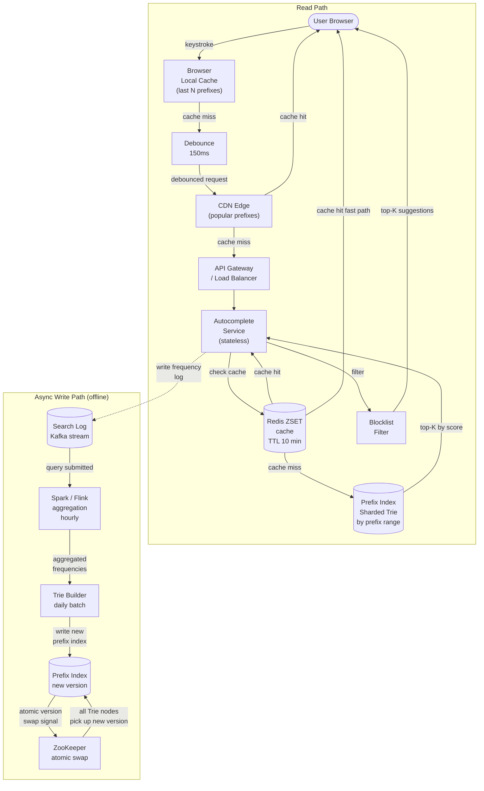

# Solution Guide — Search Autocomplete / Typeahead

## Component Map
```
[Browser] → [CDN Edge Cache] → [Load Balancer]
                                     ↓
                          [Autocomplete Service]
                          (stateless, horizontal)
                                     ↓
                     ┌───────────────┴───────────────┐
                     ↓                               ↓
              [Redis Cache]                  [Prefix Index]
              (sorted sets,                  (sharded Trie /
               TTL 10 min)                   prefix DB)
                                                     ↑
                          [Trie Builder Job] (daily batch)
                                     ↑
                          [Frequency Aggregator]
                          (Spark/Flink on Kafka)
                                     ↑
                          [Search Log Stream]
                          (every user query logged)
```

## Architecture Diagram



## Capacity Math

**Read path:**
- 10M DAU × 10 searches × 10 keystrokes = 1 billion keystrokes/day
- 1B / 86,400s = ~11,574 RPS baseline
- With debounce at 150ms: user generates ~4-5 API calls per search not 10 → 5,787 RPS baseline
- Peak 5× multiplier → ~30,000 RPS
- Round up with buffer → design for 100,000 RPS

**Storage (Prefix Index):**
- 10M unique queries × 30 bytes = 300 MB for query strings
- Trie node overhead: ~50 bytes per node × 10M queries × avg 5 shared prefixes = 2.5 GB
- Top-K per node (5 queries × 30 bytes × 10M nodes) = 1.5 GB
- Total: ~5 GB — fits in memory on a single machine; shard for redundancy

**Redis Cache:**
- Cache top 10,000 prefixes (80% of traffic per Zipf distribution — Google internal, ~2016)
- 10,000 prefixes × 5 completions × 30 bytes × 2 (overhead) = ~3 MB — trivially small
- Cache the long tail too: 1M prefixes × 5 × 30 bytes = 150 MB — still tiny

**Conclusion:** Storage is not the constraint. Latency is.

## API Design

### Autocomplete Lookup
```
GET /v1/autocomplete?q={prefix}&limit=5&locale=en-US

Response 200:
{
  "prefix": "iph",
  "completions": [
    {"query": "iphone 15", "score": 9823441},
    {"query": "iphone charger", "score": 7234102},
    {"query": "iphone case", "score": 6891230},
    {"query": "iphone 14", "score": 5102944},
    {"query": "iphone screen repair", "score": 3291022}
  ],
  "served_from": "cache"  // or "index"
}

Auth: None (public endpoint)
Rate limit: 100 req/s per IP (anti-scraping)
Cache-Control: public, max-age=600
```

### Admin: Blocklist Management
```
POST /v1/admin/blocklist
Body: {"query": "offensive term", "reason": "brand safety"}
Auth: Internal admin JWT
```

## Data Model

### Prefix Index (Redis Sorted Sets — primary serving layer)
```
Key:   "ac:prefix:{prefix}"          e.g., "ac:prefix:iph"
Type:  Redis ZSET
Members: query strings               e.g., "iphone 15"
Scores:  frequency count             e.g., 9823441
TTL:   600 seconds (10 minutes)

Index choice: Redis ZSET with ZREVRANGE gives top-K in O(log N + K) time.
Why Redis over Trie in memory: Redis is operationally simpler, horizontally scalable,
and ZRANGE is already O(log N). A custom Trie is only worth it if Redis memory cost
is prohibitive (it isn't at this scale).
```

### Frequency Store (for Trie Builder input)
```
Table: query_frequencies (BigQuery / Hive)
│ query         │ VARCHAR(200) │ The submitted query string     │
│ frequency     │ BIGINT       │ Rolling 30-day submit count    │
│ last_updated  │ TIMESTAMP    │ Last aggregation run           │
│ locale        │ VARCHAR(10)  │ en-US, zh-CN, etc.             │

Partitioned by: locale, date
Index on: query (for prefix scan during Trie Build)
```

### Blocklist
```
Table: blocklist (PostgreSQL)
│ query_pattern │ VARCHAR(200) │ Exact match or prefix wildcard │
│ reason        │ TEXT         │ Why it was blocked             │
│ added_by      │ VARCHAR(100) │ Admin user ID                  │
│ added_at      │ TIMESTAMP    │                                │

Loaded into memory on service startup, refreshed every 5 minutes.
```

## Key Design Decisions

### Decision 1: Precomputed Top-K vs. On-the-Fly Trie Traversal
**Choice made:** Precompute and store top-K completions per prefix (in Redis ZSETs, populated by daily batch job).

**Alternative rejected:** Store the full Trie in memory, traverse on every request to find top-K.

**Why this:** On-the-fly traversal means at query time you scan all children of a node recursively — O(N) in the worst case where N = nodes in subtree. For a prefix like "a" that has millions of descendants, this is catastrophically slow. Precomputing stores the answer directly at each node, making lookups O(1) after cache check. This is the same approach Google uses — precomputed suggestions served from edge caches (referenced in Jeff Dean's 2012 scalability lectures).

**Trade-off accepted:** Completions lag up to 24 hours behind real search volume. A query that goes viral at 2 PM won't appear until tomorrow's batch run. Acceptable for most use cases; if real-time freshness is needed, a streaming pipeline (Flink) can update scores hourly.

---

### Decision 2: Shard Prefix Index by Prefix Range, Not Consistent Hashing
**Choice made:** Shard the prefix index by prefix range (a-f on shard 1, g-m on shard 2, etc.) rather than hashing.

**Alternative rejected:** Consistent hashing of the prefix key.

**Why this:** Prefix range sharding allows each shard to be loaded as a contiguous slice of the alphabet. Client routing is a simple lookup table. Consistent hashing distributes prefixes randomly across shards — adding a node still requires rebalancing. The hot-prefix problem ("a", "i", "s" are disproportionately common in English) is mitigated by sub-sharding these letters.

**Trade-off accepted:** Uneven shard load due to Zipf distribution of letter frequency. The "s" shard handles more traffic than "z". Mitigate by monitoring per-shard QPS and sub-splitting hot shards.

---

### Decision 3: Client-Side Debounce as Primary Latency Control
**Choice made:** 150ms debounce on the client — only send a request when the user pauses for 150ms.

**Alternative rejected:** Throttle on the server side only (rate limit per user, no client-side change).

**Why this:** Client-side debounce eliminates the majority of API calls at zero cost. Without debounce, a user typing "iphone" sends 6 requests (one per character). With 150ms debounce, a fast typist triggers only 1-2 requests for the whole word. This reduces server load by ~70-80% and makes the latency budget trivially achievable. Server-side throttle alone doesn't help latency; it just protects availability.

**Trade-off accepted:** Debounce adds 150ms perceived delay before suggestions appear. For very slow typists, this is imperceptible. For fast typists, they see completions after they finish the word. Acceptable for most products; reduce to 100ms if UX research says users are frustrated.

## Deep Dive: The Trie and Top-K Problem

The core algorithmic challenge in autocomplete is not "find all queries with this prefix" — that's solved by a Trie. The challenge is "find the TOP-K most popular queries with this prefix, fast."

**Naive approach (wrong):** Store all queries in a Trie, traverse at query time, collect all matches, sort by frequency, return top-5. Problem: "a" has millions of descendants. Traversal is O(subtree size), which is seconds for short prefixes.

**Correct approach (precomputed top-K):** At each Trie node, store not just child pointers but the top-K completions for the entire subtree rooted at that node. Querying "iph" goes directly to the "iph" node and reads its stored top-5 list — O(1) in the Trie, O(log N) in Redis ZSET.

**Building the precomputed lists:**
1. Aggregate query frequencies from search logs (Spark job, daily).
2. Sort all queries by frequency descending.
3. Walk the Trie bottom-up: leaf nodes hold their own query. Each internal node merges its children's top-K lists and keeps only the global top-K.
4. Write the resulting (prefix → [top-K queries]) map to Redis ZSETs.

**Memory estimate for precomputed Trie:** Each node stores 5 completions × 30 bytes = 150 bytes. 10M unique queries → ~10M nodes (upper bound). 10M × 150 bytes = 1.5 GB. Fits comfortably in a single Redis instance; shard for redundancy.

**Handling trending queries (freshness):** The daily batch catches 99% of use cases. For truly viral queries (a breaking news event at 10 AM), run a streaming pipeline with Flink that updates scores every 15 minutes. The Flink job reads from the Kafka search log stream, maintains a sliding window count per query, and pushes delta updates to Redis ZSETs. This is how Google Trends works internally — a fast path for anomaly detection separate from the main indexing pipeline (Google Engineering blog, 2018).

## Failure Modes & Mitigations

| Component | Failure | Mitigation | Trade-off |
|-----------|---------|------------|-----------|
| Redis Cache | Shard goes down | Read-through to Prefix Index; other shards unaffected | Increased latency on miss; Prefix Index becomes hot |
| Prefix Index | Trie Builder produces corrupt index | Keep previous version; Builder writes to staging slot, atomic swap on validation | Extra storage (2× index size) |
| Kafka (log stream) | Lag accumulates | Autocomplete still works; freshness degrades gracefully; alert on lag > 1 hour | Trending queries take longer to appear |
| CDN | Cache poisoning with blocked query | Blocklist checked server-side before caching; Cache-Control headers prevent stale delivery | CDN hit rate drops slightly if blocklist changes frequently |
| Autocomplete Service | Pod crash | Kubernetes restarts; load balancer removes unhealthy pod; stateless design means no state lost | Brief latency spike during failover |
| Trie Builder | Daily job fails | Previous Redis data remains valid (TTL set to 25 hours, not 24) | Completions are up to 48 hours stale on double failure |

## What Strong Candidates Do Differently
1. **Immediately identify latency, not throughput, as the binding constraint.** They say "100ms total means ~20ms for network, ~30ms for Redis, ~50ms budget" and design toward that budget rather than generic "scale" concerns.
2. **Distinguish the write path from the read path.** They recognize autocomplete is a read-heavy system where the write path is async and can tolerate hours of lag. They don't try to make writes synchronous.
3. **Propose precomputed top-K explicitly** and explain why on-the-fly traversal fails for short prefixes like "a" or "i".
4. **Calculate that the index fits in memory** (a few GB) and suggest RAM-first serving before reaching for disk-backed solutions.
5. **Address the CDN opportunity** — many popular prefixes are cacheable at the edge with a short TTL. This cuts origin load by 50%+ for short prefixes.
6. **Propose debounce as the first latency optimization**, not a server-side rate limiter.

## What Average Candidates Miss
- **The "a" problem**: Candidates design a trie and say "traverse and return top-5" without realizing that for common single-letter prefixes, traversal touches millions of nodes. This is the central algorithmic failure in autocomplete interviews.
- **Write path is async**: Candidates try to update the trie on every query submission in real-time, conflating the read and write paths and creating write amplification.
- **Redis ZSETs are purpose-built**: Many candidates propose a custom in-memory trie when Redis sorted sets already solve the top-K retrieval problem with O(log N) complexity and operational simplicity.
- **Cache at multiple levels**: Missing the CDN → Redis → Prefix Index layering means they rely on a single cache layer and cannot achieve the latency budget under peak load.
- **Blocklist as an afterthought**: Treating blocklist as a post-hoc filter rather than designing where in the pipeline it runs (always server-side, never client-side, never in the cache key).
