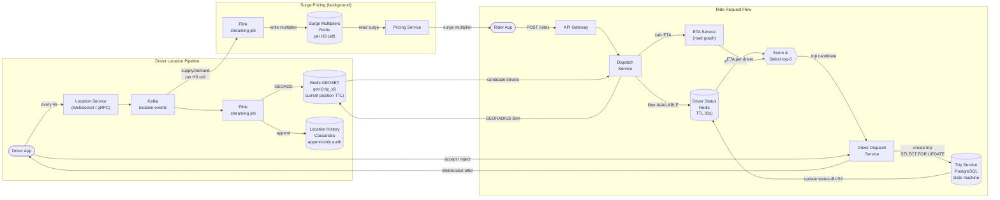
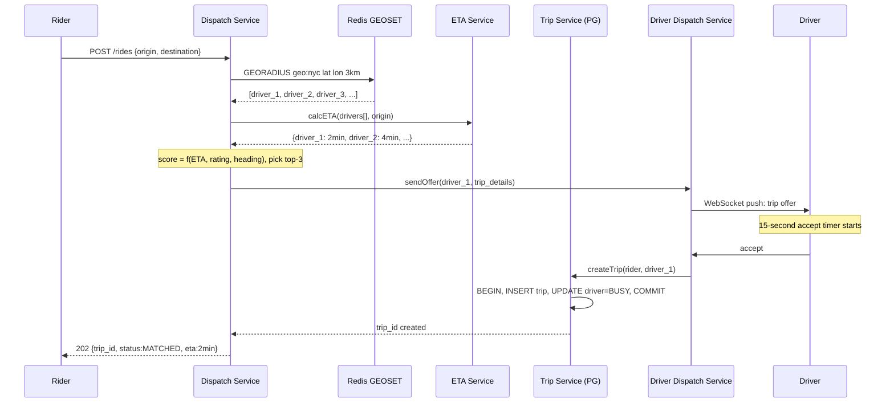
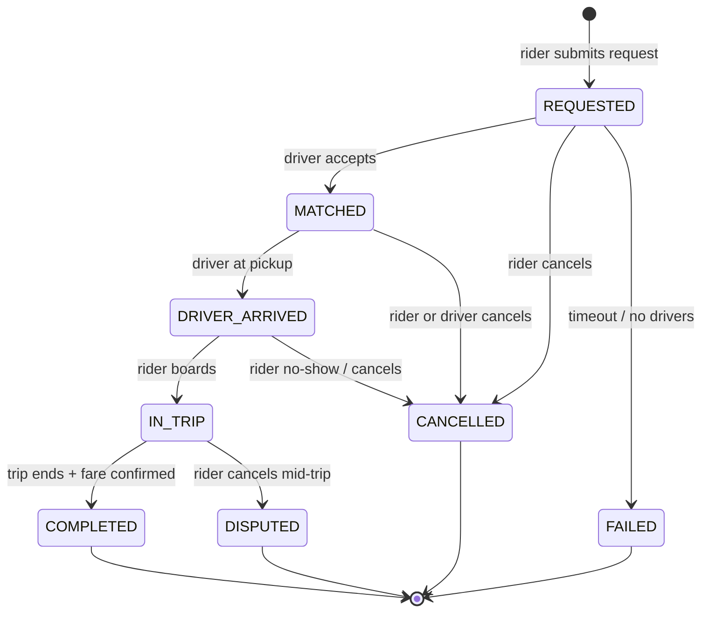

# Solution Guide — Ride Sharing (Uber / Lyft)

## Component Map
```
[Driver App] ──location updates──► [Location Service]
                                          │
                                          ▼
                                   [Redis GEOSET]
                                   (geospatial index)
                                          │
[Rider App] ──ride request──► [Dispatch Service] ◄── [Surge Engine]
                                          │
                                   [Match Algorithm]
                                   (GEORADIUS + score)
                                          │
                                          ▼
                               [Trip Request → Driver]
                                     (via WebSocket / Push)
                                          │
                                   Driver Accepts
                                          │
                                          ▼
                               [Trip Service]
                               (PostgreSQL, state machine)
                                          │
                              ┌───────────┴───────────┐
                              ▼                       ▼
                     [Location Sharing]       [Fare Calculator]
                     (WebSocket, rider         (on COMPLETED)
                      sees driver move)
```

## Architecture Diagram



## Sequence Diagram: Ride Request Flow



## State Diagram: Trip Lifecycle



## Capacity Math

**Driver location updates:**
- 500K active drivers × (1 update / 4 seconds) = 125,000 writes/second
- Peak 4× = 500,000 writes/second
- Each update: 50 bytes
- Write throughput: 500K × 50 bytes = 25 MB/sec
- (Source: Uber engineering blog 2016 described handling 1M location updates/min at scale — ~16,667/sec — this design is at 2023 scale)

**Redis GEOSET memory:**
- 500K driver entries per city (worst case: NYC peak)
- Each Redis GEOSET entry: ~80 bytes (driver_id + coordinates encoded as geohash in sorted set)
- 500K × 80 bytes = 40 MB — trivially small for one city
- 500 cities: 500 × 40 MB = 20 GB — fits in a single large Redis instance; shard by city for latency

**Ride requests:**
- 26M trips/day / 86,400s = 301 trip requests/second
- Each request triggers a GEORADIUS query + scoring + assignment
- 301 dispatches/second — easily handled by a small cluster of Dispatch Service instances

**Trip storage (PostgreSQL):**
- 26M trips/day × 1 KB per trip record = 26 GB/day
- 1 year: ~9.5 TB — manageable with partitioning by date

## API Design

### Rider: Request a Ride
```
POST /v1/rides
Authorization: Bearer {rider_token}
{
  "origin": {"lat": 40.7128, "lon": -74.0060},
  "destination": {"lat": 40.7580, "lon": -73.9855},
  "ride_type": "standard"
}

Response 202:
{
  "ride_id": "ride_abc123",
  "status": "SEARCHING",
  "estimated_wait_seconds": 180,
  "surge_multiplier": 1.4
}
```

### Driver: Update Location
```
POST /v1/drivers/location
Authorization: Bearer {driver_token}
{
  "lat": 40.7128,
  "lon": -74.0060,
  "heading": 245,
  "speed_kmh": 32,
  "timestamp": 1735000000000
}

Response 200:
{
  "status": "ok",
  "surge_zone": "1.2x"  // driver sees their current surge zone
}
```

### Driver: Respond to Trip Request
```
POST /v1/trips/{trip_id}/respond
Authorization: Bearer {driver_token}
{
  "action": "accept"  // or "reject"
}

Response 200:
{
  "trip_id": "trip_xyz789",
  "rider": { "name": "Alice", "rating": 4.8 },
  "pickup": {"lat": 40.7128, "lon": -74.0060},
  "destination": {"lat": 40.7580, "lon": -73.9855}
}
```

### Real-Time Location Stream (WebSocket during trip)
```
// After trip is DRIVER_ASSIGNED, both rider and driver subscribe:
WS /v1/trips/{trip_id}/location-stream
Authorization: Bearer {token}

// Server pushes every 4 seconds:
{
  "driver_lat": 40.7130,
  "driver_lon": -74.0050,
  "eta_seconds": 240
}
```

## Data Model

### Trips (PostgreSQL — strong consistency required)
```
Table: trips
┌──────────────────┬───────────────┬─────────────────────────────────────────┐
│ trip_id          │ UUID          │ Primary key                             │
│ rider_id         │ UUID          │ FK to users                             │
│ driver_id        │ UUID          │ FK to drivers; NULL until assigned      │
│ status           │ ENUM          │ REQUESTED/DRIVER_ASSIGNED/IN_PROGRESS/  │
│                  │               │ COMPLETED/CANCELLED/FAILED              │
│ origin_lat       │ DECIMAL(9,6)  │                                         │
│ origin_lon       │ DECIMAL(9,6)  │                                         │
│ dest_lat         │ DECIMAL(9,6)  │                                         │
│ dest_lon         │ DECIMAL(9,6)  │                                         │
│ surge_multiplier │ DECIMAL(4,2)  │ Locked at request time                  │
│ fare_cents       │ INTEGER       │ Calculated on COMPLETED; NULL until then│
│ requested_at     │ TIMESTAMPTZ   │                                         │
│ matched_at       │ TIMESTAMPTZ   │                                         │
│ completed_at     │ TIMESTAMPTZ   │                                         │
│ version          │ INTEGER       │ Optimistic lock for state transitions   │
└──────────────────┴───────────────┴─────────────────────────────────────────┘

Index: (driver_id, status) — for "find driver's current trip"
Index: (rider_id, status) — for "find rider's current trip"
Index: (requested_at) — for analytics and partitioning

Why PostgreSQL: Trip is a state machine with strict consistency requirements.
Double-booking (two trips with same driver) is catastrophic. PostgreSQL row-level
locking and SERIALIZABLE transactions prevent this. Cassandra's eventual consistency
is wrong here.
```

### Driver Status Cache (Redis)
```
Key:   "driver:{driver_id}:status"
Value: "AVAILABLE" | "BUSY" | "OFFLINE"
TTL:   20 seconds (refreshed by location updates; stale = OFFLINE)

Reason for Redis: Dispatch Service queries driver status for 50-100 candidates
per match request. PostgreSQL round-trips for 100 status queries would add 10-50ms.
Redis round-trips: < 1ms each, pipelined: < 2ms for 100.
```

### Driver Location (Redis GEOSET)
```
Key:   "geo:{city_id}"    e.g., "geo:nyc", "geo:sf"
Type:  Redis Sorted Set (GEOSET — scores are geohash values)
Members: driver_id strings
Command: GEOADD geo:nyc 40.7128 -74.0060 "driver_123"
Query:   GEORADIUS geo:nyc 40.7128 -74.0060 3 km WITHCOORD COUNT 50 ASC

Why GEOSET over Geohash sharding: Redis GEOSET internally uses geohash encoding
but exposes a clean radius query API. No custom geohash implementation needed.
Simpler to operate. Uber's internal system (H3 hexagonal grid) is more sophisticated
but requires custom spatial indexing code — overkill for this interview.
```

### Location History (Cassandra — append-only audit log)
```
Table: driver_location_history
Partition key: driver_id
Clustering key: recorded_at DESC

┌─────────────┬───────────┬──────────────────────────────────┐
│ driver_id   │ UUID      │ Partition key                    │
│ recorded_at │ TIMESTAMP │ Clustering key (time-sorted)     │
│ lat         │ DOUBLE    │                                  │
│ lon         │ DOUBLE    │                                  │
│ heading     │ INTEGER   │ 0-359 degrees                    │
│ speed_kmh   │ FLOAT     │                                  │
│ trip_id     │ UUID      │ NULL if between trips            │
└─────────────┴───────────┴──────────────────────────────────┘

TTL: 90 days
Use case: trip replay (rider reviews route), fraud detection, driver earnings disputes
```

## Key Design Decisions

### Decision 1: Redis GEOSET vs Custom Geohash Sharding vs QuadTree
**Choice made:** Redis GEOSET for the driver location serving index.

**Alternative rejected (Geohash manual sharding):** Divide the map into geohash cells (precision 6 = ~1.2 km × 0.6 km cells). Store drivers in a hash table keyed by geohash. To find nearby drivers, query the 9 geohash cells surrounding the rider.

**Alternative rejected (QuadTree in memory):** Build an in-memory spatial tree, recursively subdivide space. Used by Twitter for geotagged tweets and Uber's H3 system.

**Why Redis GEOSET:** Redis GEOSET provides a production-ready spatial index with O(log N + M) radius queries. No custom implementation, no edge case bugs on geohash cell boundaries, no tree rebalancing. For an interview, this is the correct answer — pragmatic, scalable, operationally well-understood. Manual geohash is only better if you need geohash-encoded keys as part of a larger distributed sharding scheme (which requires significantly more implementation work).

**Trade-off accepted:** Redis GEOSET doesn't support polygon queries or arbitrary spatial predicates. For Uber's real "match within service area" queries (city boundaries, airport geofences), you'd need a more sophisticated spatial index. In this design, we simplify to radius queries within a city's GEOSET.

---

### Decision 2: Strong Consistency for Trip State via PostgreSQL with Row Locking
**Choice made:** PostgreSQL for the trips table, with `SELECT FOR UPDATE` during driver assignment to prevent double-booking.

**Alternative rejected:** Cassandra or DynamoDB with optimistic concurrency (conditional writes / compare-and-swap).

**Why PostgreSQL:** The trip state machine has strict invariants: a driver cannot be in two trips simultaneously; a rider cannot have two active trips. These are multi-row constraints (trip record + driver status must change atomically). PostgreSQL's SERIALIZABLE isolation handles this without application-level distributed locking. The transaction: `BEGIN; SELECT driver WHERE driver_id=? FOR UPDATE; IF status=AVAILABLE: INSERT trip; UPDATE driver status=BUSY; COMMIT`.

**Trade-off accepted:** PostgreSQL is the scale bottleneck. 300 trip assignments/second is fine for a single primary, but at 10× Uber scale we'd need sharding by city. Also, a PostgreSQL primary failure requires a failover (typically 30-60 seconds). Mitigate with read replicas for status queries and a standby replica with automatic failover.

---

### Decision 3: Push Trip Request to Driver (vs Driver Polling)
**Choice made:** Server pushes trip requests to driver app via persistent WebSocket or APNs/FCM.

**Alternative rejected:** Driver app polls every 2-3 seconds: "are there any trip requests for me?"

**Why push:** At 500K active drivers, polling every 3 seconds = 166,667 requests/second of pure overhead with zero business value — just checking if there's work. Push delivers the request only when a match occurs, reducing driver-side load by orders of magnitude. Also, 3-second poll interval adds up to 3 seconds of match latency for the winner of a poll cycle, whereas WebSocket push delivers within milliseconds.

**Trade-off accepted:** Maintaining 500K persistent WebSocket connections requires careful connection management on the driver app (reconnect logic, battery optimization). The driver app must re-establish the WebSocket on network changes. This is solved in practice: Uber's driver app maintains a WebSocket for dispatching and handles network transitions gracefully.

## Deep Dive: The Matching Algorithm

The matching algorithm is the heart of the dispatch system. The naive approach — "find the closest available driver" — is wrong in practice. Here's why and what to do instead.

**Why closest driver is wrong:**

1. **Heading alignment matters.** A driver 400m away heading directly away from the rider will take longer to arrive than a driver 600m away heading toward them. Ignoring heading overestimates the ETA for the closest driver.

2. **Multiple simultaneous requests.** If three riders all request a ride at the same second, naive closest-driver matching assigns the single nearest driver to the first request received, leaving the other two with worse options. An optimal assignment considers all pending requests together.

3. **Driver acceptance probability.** A driver at the end of a long shift who is 200m away has a higher probability of rejection than a fresh driver 500m away. Including predicted acceptance probability reduces re-matching latency.

**Uber's actual approach (documented in their 2016 VLDB paper):**

Uber frames dispatch as a batch optimization problem: every few seconds, compute the globally optimal assignment between the set of pending rider requests and available drivers, minimizing total ETA across all pairs. This is a bipartite matching problem, solved with algorithms like the Hungarian algorithm or, at scale, approximate greedy algorithms.

For this interview, propose:

```
Scoring function for candidate driver D for rider R:
  score(D, R) = w1 × ETA(D→R) + w2 × (1 - driver_acceptance_rate) + w3 × driver_rating_penalty

Where:
  ETA(D→R) = straight-line distance / avg_speed × heading_adjustment_factor
  driver_acceptance_rate = accepted_trips / requested_trips (last 30 days)
  w1, w2, w3 = tuned weights (w1 dominates)
```

**Preventing double-assignment:**

The match algorithm runs across many Dispatch Service instances in parallel. Without coordination, two instances could select the same driver for different riders simultaneously. Solution: before confirming the match, the Dispatch Service acquires a distributed lock on the driver (Redis SETNX with 15-second TTL). Only one instance wins; the other retries with the next candidate. This is analogous to the "optimistic booking" pattern in hotel reservation systems.

## Failure Modes & Mitigations

| Component | Failure | Mitigation | Trade-off |
|-----------|---------|------------|-----------|
| Redis GEOSET (location index) | Redis shard down | Read-only replica serves GEORADIUS queries; writes buffer in Kafka until Redis recovers | Location data becomes stale; matches may be slightly less optimal |
| PostgreSQL (trip state) | Primary failure | Automatic failover to replica (~30s); during failover, new trip assignments fail; existing trips continue | Brief 30s window where new rides can't be requested; in-progress trips unaffected |
| Dispatch Service | Instance crash | Stateless; Kubernetes restarts; pending matches re-evaluated by other instances | In-flight matches may time out and re-trigger; driver gets re-notified |
| Driver WebSocket disconnect | Driver misses trip request | Fall back to APNs/FCM push notification; driver sees request in app | Slightly higher latency (2-5s for push) vs WebSocket (< 500ms) |
| Surge Engine | Calculation stale | Trips still proceed; surge multiplier defaults to 1.0 or last known value | Riders may under-pay during real surge; acceptable short-term |
| Location Service overload | Cannot process 500K updates/sec | Drop location updates (lossy); last known position used | Driver location appears stale to rider; ETA accuracy degrades |

## What Strong Candidates Do Differently
1. **Identify driver location updates as the write bottleneck** immediately — 125K-500K writes/second is the highest load component, not trip requests.
2. **Propose a separate data store for location (Redis GEOSET) vs trip state (PostgreSQL)** — they understand these have fundamentally different consistency requirements.
3. **Walk through the double-booking scenario** — "what prevents two riders from matching to the same driver?" and propose distributed locking.
4. **Describe the trip state machine explicitly** with all states and transitions before diving into components.
5. **Quantify the fan-out for real-time location sharing** — "during a trip, both rider and driver receive location updates. At 100K concurrent trips, that's 200K WebSocket pushes every 4 seconds."

## What Average Candidates Miss
- **Location update volume**: Candidates calculate trip requests per second (300/sec, manageable) but miss that driver location updates are 400× higher volume (125K-500K/sec). This is the actual scaling challenge.
- **Double-booking prevention**: No mechanism to prevent two simultaneous matches to the same driver. This is a race condition that requires distributed locking or database-level pessimistic locking.
- **Trip state machine**: Candidates jump to component design without defining the state machine. Without this, the system has no answer for "what happens if the driver doesn't respond?" or "what happens if the rider cancels after driver accepted?"
- **Geospatial data structure**: Vague "database with location query" without specifying the index structure. The spatial index is the core data structure of this problem.
- **ETA vs distance**: Candidates use Euclidean distance as a proxy for ETA. In urban environments, a 500m straight-line distance may be a 5-minute drive due to one-way streets and traffic.
