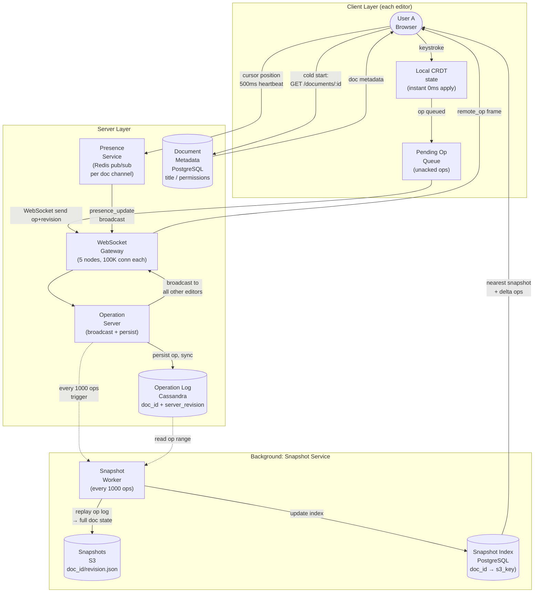
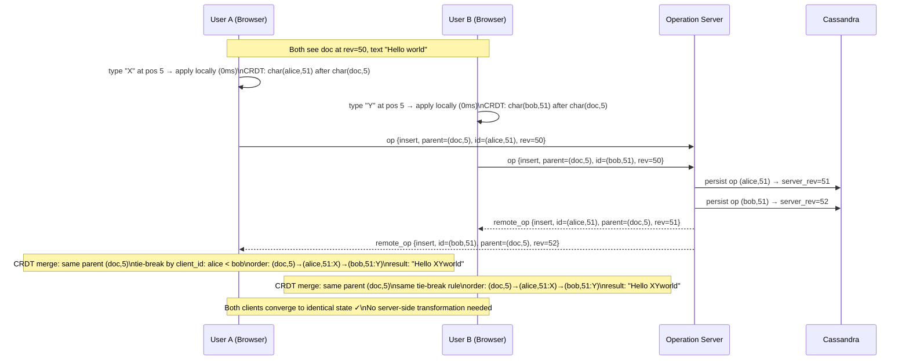

# Solution Guide — Collaborative Editor

## Component Map
```
[Browser A] ──op──► [WebSocket Gateway] ──op──► [Browser B]
                           │                    [Browser C]
                           ▼
                    [Operation Server]
                    (OT transform / CRDT merge)
                           │
                ┌──────────┴──────────┐
                ▼                     ▼
         [Operation Log]      [Document Snapshot]
         (Cassandra,           (S3, periodic full
          append-only)          state checkpoint)
                           │
                    [Presence Service]
                    (Redis pub/sub,
                     cursor positions)
```

## Architecture Diagram



## Sequence Diagram: Concurrent Edit Resolution



## Capacity Math

**Operation throughput:**
- 100K active documents × 5 editors × 3 keystrokes/sec = 1.5M ops/sec
- (This is a ceiling; real typing is bursty, not sustained at 3 chars/sec)
- Realistic sustained: 20% of peak = 300K ops/sec
- Each op: 50 bytes
- Write throughput: 300K × 50 bytes = 15 MB/sec

**Operation log storage:**
- 300K ops/sec × 50 bytes = 15 MB/sec
- Per day: 15 MB × 86,400 = 1.3 TB/day
- With 3× replication: 3.9 TB/day
- Retain 1 year: ~1.4 PB (use tiered storage — hot for 30 days, cold archive beyond)

**WebSocket connections:**
- 100K active documents × 5 editors = 500K concurrent WebSocket connections
- WebSocket Gateway handles 100K connections per node → 5 nodes minimum at peak

**Snapshot storage (S3):**
- 10M documents × 50 KB average = 500 GB at rest
- Snapshots taken every 1,000 ops; cheap S3 storage

**Cold start cost without snapshots:**
- A 10,000-op document would require replaying 10,000 ops on each open
- With snapshots every 1,000 ops: maximum 999 ops to replay
- Snapshot reduces cold start from seconds to milliseconds

## API Design

### WebSocket: Send Operation
```
// Client → Server
{
  "type": "op",
  "doc_id": "doc_abc123",
  "client_id": "user_alice",
  "client_revision": 42,        // client's view of document revision
  "operations": [
    {
      "type": "insert",
      "position": 5,             // OT: integer position; CRDT: parent_id
      "content": "X",
      "timestamp_client": 1735000000000
    }
  ]
}

// Server → Client (acknowledgment)
{
  "type": "ack",
  "client_revision": 42,
  "server_revision": 43
}
```

### WebSocket: Receive Remote Operation
```
// Server → all other clients in document room
{
  "type": "remote_op",
  "server_revision": 43,
  "operations": [
    {
      "type": "insert",
      "position": 6,             // transformed position (OT) or parent_id (CRDT)
      "content": "X",
      "author": "alice"
    }
  ]
}
```

### REST: Load Document
```
GET /v1/documents/{doc_id}
Authorization: Bearer {token}

Response 200:
{
  "doc_id": "doc_abc123",
  "title": "My Document",
  "content": "...",              // full text at snapshot revision
  "server_revision": 43,        // client uses this for first WebSocket connection
  "snapshot_revision": 40,      // revision of the snapshot used
  "ops_since_snapshot": [...]    // ops 41-43 applied on top of snapshot
}
```

### REST: Document History
```
GET /v1/documents/{doc_id}/history?from_rev=0&to_rev=100

Response 200:
{
  "operations": [
    {
      "revision": 42,
      "type": "insert",
      "position": 5,
      "content": "X",
      "author_id": "user_alice",
      "timestamp": 1735000000000
    }
  ]
}
```

### WebSocket: Presence Update
```
// Client sends cursor position every 500ms while active:
{
  "type": "presence",
  "cursor_position": 142,
  "selection_start": 142,
  "selection_end": 142
}

// Server broadcasts to all editors:
{
  "type": "presence_update",
  "user_id": "user_alice",
  "cursor_position": 142,
  "color": "#FF6B6B"
}
```

## Data Model

### Operation Log (Cassandra)
```
Table: document_operations
Partition key: doc_id
Clustering key: server_revision ASC

┌──────────────────┬───────────────┬────────────────────────────────────────────┐
│ doc_id           │ UUID          │ Partition key — all ops for one doc together│
│ server_revision  │ BIGINT        │ Monotonically increasing; server-assigned   │
│ client_id        │ VARCHAR       │ Which client sent this op                   │
│ client_revision  │ BIGINT        │ Client's revision when op was sent          │
│ op_type          │ ENUM          │ insert / delete / retain / format           │
│ position         │ INTEGER       │ OT: character index; CRDT: encoded parent id│
│ content          │ TEXT          │ Inserted text (NULL for delete)             │
│ created_at       │ TIMESTAMPTZ   │ Server receipt time                         │
└──────────────────┴───────────────┴────────────────────────────────────────────┘

Why Cassandra: Operations are append-only (never updated), partitioned by doc_id
(all ops for a document are co-located), and queried by revision range. This is the
ideal Cassandra access pattern. Write throughput of 300K ops/sec across thousands
of documents — distributed across Cassandra nodes by doc_id hash.

Why NOT update operations: Operations are immutable once committed. Transformations
produce new operations; original ops are preserved for history and undo.
```

### Document Snapshots (S3 + metadata in PostgreSQL)
```
S3 key: "snapshots/{doc_id}/{revision}.json"
Content: Full document state as JSON (or binary for large docs)

PostgreSQL table: document_snapshots
┌─────────────────┬──────────────┬──────────────────────────────────────────────┐
│ doc_id          │ UUID         │                                              │
│ snapshot_rev    │ BIGINT       │ The server_revision this snapshot reflects   │
│ s3_key          │ VARCHAR      │ Pointer to S3 object                         │
│ size_bytes      │ INTEGER      │                                              │
│ created_at      │ TIMESTAMPTZ  │                                              │
└─────────────────┴──────────────┴──────────────────────────────────────────────┘

Snapshotting trigger: every 1,000 operations OR every 24 hours, whichever first.
Cold start: load latest snapshot, then replay ops from (snapshot_rev+1) to current.
```

### Presence (Redis pub/sub — ephemeral)
```
Redis channel: "presence:{doc_id}"
Message: { "user_id": "alice", "cursor": 142, "color": "#FF6B6B" }
TTL: messages expire after 2 seconds (client resends every 500ms)

Why ephemeral: Cursor positions have no persistence value. If the server restarts,
cursor positions reset. This is acceptable — presence is cosmetic.
Why Redis pub/sub (not document op log): Presence doesn't need durability, history,
or ordering guarantees. Pub/sub with no persistence is perfect.
```

## Key Design Decisions

### Decision 1: CRDT vs Operational Transformation
**Choice made:** CRDT (Conflict-free Replicated Data Type) for new systems; note that Google Docs originally used OT.

**Alternative (OT — Operational Transformation):** Each operation includes a revision number. The server has a single authoritative sequencer. When two concurrent operations arrive (both based on revision N), the server transforms one against the other using a transformation function. For insert operations: if Alice inserts at position 5 and Bob inserts at position 3 concurrently, Alice's operation is transformed to insert at position 6 (Bob's insert shifted Alice's target position).

**Why CRDT over OT:** OT has a fundamental architectural dependency: a central server that serializes all operations and applies transformations. This makes OT inherently non-distributed — you cannot have two active servers transforming concurrently without a consensus protocol. CRDT's core insight is assigning each character a unique, immutable identifier and a parent-child position relative to other characters (not integer indices). Integer indices shift when other characters are inserted or deleted — this is the source of all OT complexity. Character IDs don't shift. Any order of applying CRDT operations produces identical results — true commutativity. Figma and Linear both use CRDTs. Google Docs is migrating away from OT. (Source: Martin Kleppmann's "Designing Data-Intensive Applications", 2022 edition notes)

**Trade-off accepted:** CRDTs have higher memory overhead — each character stores its ID (~16-24 bytes) in addition to its value (1-4 bytes for Unicode). A 50KB document becomes ~1MB in CRDT representation. For most documents this is acceptable. For very large documents (10MB+), memory pressure is real. Mitigation: compact CRDT representations (e.g., Yjs achieves near-plaintext memory usage by compressing runs of consecutive insertions).

---

### Decision 2: Optimistic Local Apply (No Lock-and-Wait)
**Choice made:** Apply operations to local state immediately, before server acknowledgment (optimistic).

**Alternative rejected:** Pessimistic locking — client sends operation, waits for server confirmation, then updates local display.

**Why optimistic:** Typing latency is the most sensitive UX dimension in a text editor. Users can feel latency above 30ms as "lag" in their editor. Any network round-trip (minimum 50-200ms even in good conditions) inserted between keystroke and character appearance makes the editor feel broken. Optimistic local apply means the character appears instantly. If the server later rejects or transforms the operation, the client reconciles by rewinding and re-applying. In practice, conflicts requiring rewind are rare (< 0.1% of operations in typical collaborative sessions).

**Trade-off accepted:** The client state may temporarily diverge from the server state. The client must maintain an "in-flight" queue of sent-but-not-acked operations and a reconciliation procedure for when the server returns a transformed version. This adds significant client-side complexity (especially undo, which must operate on a mix of local and confirmed operations).

---

### Decision 3: Separate Presence from Document Operations
**Choice made:** Use a separate ephemeral channel (Redis pub/sub) for cursor presence, completely independent of the document operation pipeline.

**Alternative rejected:** Encode cursor position as a document operation — treat "Alice's cursor is at position 142" as an op in the op log, persisted in Cassandra.

**Why separate:** Cursor positions are ephemeral, high-frequency, and valueless for history. A user moving their cursor generates 2 presence updates/second. For 500 active editors × 2/sec = 1,000 presence events/second per active document. Persisting these to Cassandra would: (1) inflate the op log with valueless entries, (2) make history replay noisy, (3) require clients to skip presence ops when replaying, (4) make undo logic complex (undo applies to content ops, never presence ops). Separating presence into Redis pub/sub: presence is never persisted, never replayed, never undone. Presence loss on server restart is acceptable — editors see cursors re-appear within 500ms.

**Trade-off accepted:** Presence and document operations travel through different channels. Client must manage two WebSocket multiplexed channels (or two connections). On reconnect, presence must be re-established separately from document sync. Minor complexity for significant architectural cleanliness.

## Deep Dive: Operational Transformation vs CRDTs — The Core Algorithm

This is the most technically rich part of the collaborative editor problem. Most candidates who study "system design" never go this deep. Here is the explanation that distinguishes strong candidates.

**The fundamental problem:**

Consider a document with text "ac". Two users concurrently:
- Alice: insert "b" at position 1 → "abc"
- Bob: insert "d" at position 1 → "adc"

Without coordination, Alice's state is "abc" and Bob's state is "adc" — diverged.

**OT solution:**

Server receives Alice's op (insert "b" at 1) first, then Bob's op (insert "d" at 1).

Bob's op was based on the document before Alice's insert. The server transforms Bob's op against Alice's op:
- Alice inserted at position 1. Bob also inserted at position 1. Both want to be at position 1.
- Transformation rule: if positions are equal, Bob's insert is shifted by 1 (Alice wins the tie).
- Transformed Bob op: insert "d" at position 2.

Result: both clients apply ops in order → "abdc". Converged. ✓

The transformation function `T(op_a, op_b)` takes two concurrent operations and returns a transformed version of `op_b` that, when applied after `op_a`, produces the correct result. OT requires:
1. A correct transformation function for every pair of operation types.
2. A server that serializes all operations (total order).
3. Clients to send their revision number so the server knows what to transform against.

**CRDT solution (specifically: a tree-based CRDT like LSEQ or Yjs):**

Each character gets a unique ID: `(client_id, local_clock)`.
Each character has a "parent": the character it was inserted after.

Alice's insert: ID=(alice, 1), content="b", parent=(doc, 1) — inserted after character at doc position 1 ("a").
Bob's insert: ID=(bob, 1), content="d", parent=(doc, 1) — also inserted after "a".

Both characters have the same parent. Tie-breaking rule: sort by client_id alphabetically. "alice" < "bob", so Alice's character comes first.

After both clients apply both ops (in any order):
- Tree structure: [a] → [(alice,1):"b"] → [(bob,1):"d"] → [c]
- Linear read: "abdc" ✓

The key insight: CRDTs define position by parentage (immutable), not by integer index (mutable). No transformation needed. Operations commute — applying them in any order gives the same result.

**Why most interview candidates miss this:**

They know that Google Docs uses "something like a CRDT" or "something like OT" but cannot explain the core insight: the problem is that integer positions shift when text is inserted or deleted, and CRDTs solve this by using immutable character identifiers instead of mutable positions.

**What to say in the interview:**

"The root cause of conflict in concurrent text editing is that integer positions are mutable — inserting a character shifts all subsequent positions. Operational Transformation handles this by transforming position values at the server. CRDTs handle this by eliminating integer positions entirely — each character has a permanent, globally unique identity relative to its parent character. This makes CRDT operations commutative: any order of application produces the same result. I'd choose CRDT for a new system because it removes the central serialization bottleneck and enables true peer-to-peer merging."

## Failure Modes & Mitigations

| Component | Failure | Mitigation | Trade-off |
|-----------|---------|------------|-----------|
| Operation Server crash | In-flight ops lost, clients disconnected | Client retains unacked ops in memory; reconnects, re-sends ops with last_server_revision; server deduplicates by client_id + client_revision | Brief edit loss (< 5 seconds of typing); users see reconnecting indicator |
| Cassandra op log slow | Operation persistence latency spikes | Buffer ops in memory; batch-persist; broadcast to other clients before persistence (fire-and-forget) | Risk of op loss if server crashes between broadcast and persistence |
| WebSocket Gateway crash | All editors in active documents disconnected | Clients reconnect to new gateway; document state reloaded from Cassandra + snapshot | Cold start for all active documents simultaneously; potential spike in Cassandra reads |
| Clock skew between clients | Operation timestamps unreliable for ordering | Never use client timestamps for ordering; use server_revision (monotonically increasing, server-assigned) as authoritative order | Server revision requires single sequencer; bottleneck at very high op rates |
| CRDT memory explosion | Large document with many deletions creates tombstone accumulation | Periodic garbage collection: remove tombstones that are causally stable (all clients have acknowledged seeing them) | GC pauses visible to user as brief freeze; schedule during inactive periods |
| Snapshot job failure | Cold start requires replaying entire op log | Keep last 3 snapshots; alert on snapshot age > 2,000 ops; manual trigger available | Cold start latency degrades as op log grows between failed snapshot runs |

## What Strong Candidates Do Differently
1. **Name OT vs CRDT as a fundamental design choice** — they don't hand-wave "synchronization algorithm"; they say "I'd choose CRDT over OT because OT requires a central serializer, which limits horizontal scaling."
2. **Explain the root cause of conflicts** — "integer positions are mutable; this is why naive merging fails; both OT and CRDT solve this differently."
3. **Separate presence from operations** — they immediately call out that cursor positions are ephemeral and must NOT go through the document operation pipeline.
4. **Design client-side operation queuing** — they describe the "pending ops" queue on the client and the reconciliation procedure for when server returns a transformed op.
5. **Explain optimistic local apply** and why it's non-negotiable for text editor UX.

## What Average Candidates Miss
- **The core conflict resolution algorithm**: Most candidates say "I'll use WebSockets and sync changes" without explaining what happens when two users edit the same character simultaneously.
- **OT vs CRDT distinction**: Candidates conflate these or use "CRDT" as a buzzword without explaining the difference.
- **Undo complexity in collaborative context**: Standard undo (pop last op from stack) doesn't work when other users have made edits since your last op. "Selective undo" — undo your op without undoing others — requires sophisticated op inversion.
- **Cold start cost**: What happens when you open a document that has 50,000 operations? Without snapshots, the client replays all 50,000 ops. This is catastrophically slow for large documents.
- **Presence as a separate concern**: Mixing cursor presence into the document operation log creates unnecessary complexity and inflates op log size.
