# Solution Guide — Distributed Cache

## Component Map
```
[App Server]
    │
    │ Cache Client (library, embedded in app server)
    │ - Maintains consistent hash ring
    │ - Routes GET/SET/DELETE to correct node
    │
    ├──GET("user:123")──► [Cache Node A] (ring position covers "user:*")
    │                          │ HIT → return value
    │                          │ MISS → app server hits database, then SET
    │
    ├──SET("session:abc")──► [Cache Node C] (ring position covers "session:*")
    │
    └──DELETE("config:x")──► [Cache Node B]


REPLICATION:
    SET("key") → Primary Node (ring position)
                     │
                     ├──async replicate──► Replica Node (next on ring)
                     └──async replicate──► Replica Node 2 (next+1 on ring)


NODE ADDITION:
    New node joins ring at position P.
    Keys in range (predecessor_of_P, P] move from old owner to new node.
    Only ~1/N of keys move. Other keys unaffected.
```

## Architecture Diagram

```mermaid
flowchart TD
    subgraph ReadPath["Cache-Aside Read Path"]
        APP([Application\nServer])
        CCL["Cache Client\nLibrary\n(embedded in app)\nholds ring topology"]
        HASH{{"hash(key)\n→ find node\non ring"}}
        CN_HIT["Cache Node\n(responsible\nfor key range)"]
        DB[("Origin DB\nPostgreSQL /\nMySQL")]
        POPULATE["Cache Client\npopulates:\nSET key value TTL"]

        APP -->|GET key| CCL
        CCL -->|compute| HASH
        HASH -->|route to\nprimary node| CN_HIT
        CN_HIT -->|cache HIT\nO1 hashtable\nupdate LRU| APP
        CN_HIT -->|cache MISS\nreturn null| CCL
        CCL -->|miss fallback| DB
        DB -->|value| POPULATE
        POPULATE -->|SET key| CN_HIT
        POPULATE -->|return value| APP
    end

    subgraph WritePath["Write-Through Write Path"]
        APP2([Application\nServer])
        CCL2["Cache Client\nLibrary"]
        CN_W["Cache Node\n(primary)"]
        DB2[("Origin DB")]
        REP["Replica Node\n(next on ring)"]

        APP2 -->|SET key value| CCL2
        CCL2 -->|write to\ncache node| CN_W
        CCL2 -->|write to DB, sync| DB2
        DB2 -->|ack| CCL2
        CN_W -->|async replicate| REP
        CCL2 -->|ack to app| APP2
    end

    subgraph ThunderingHerd["Thundering Herd: SETNX Lock Pattern"]
        MISS2{{"Cache MISS\non hot key"}}
        LOCK["SETNX\nlock:{key}\nTTL=5s"]
        WIN{{"lock\nacquired?"}}
        FETCH["Query\nOrigin DB"]
        SET2["SET key value\nDELETE lock"]
        WAIT["sleep 50ms\nretry GET"]

        MISS2 --> LOCK
        LOCK --> WIN
        WIN -->|yes — lock winner| FETCH
        FETCH --> SET2
        WIN -->|no — lock loser| WAIT
        WAIT -->|retry hit cache| SET2
    end
```



## Capacity Math

**Node count:**
- 64 TB total cache data / 32 GB per node = 2,048 primary nodes
- With 1 replica per key: 4,096 nodes total
- With virtual nodes (150 per physical node): 2,048 × 150 = 307,200 v-node positions on the ring

**Memory per node:**
- 32 GB physical RAM
- OS + process overhead: ~2 GB
- Available for cache: 30 GB
- At 1 KB average value size: 30 million keys per node
- Cluster total: 2,048 × 30M = 61 billion keys

**Throughput:**
- 10M reads/sec across 2,048 nodes = ~4,882 reads/sec per node (trivial for in-memory)
- 100K writes/sec across 2,048 nodes = ~49 writes/sec per node (trivial)
- Bottleneck is network bandwidth, not computation
- 10M reads × 1 KB = 10 GB/sec network throughput from cache cluster
- Each node: 10 GB / 2,048 ≈ 5 MB/sec per node — well within 1 Gbps NIC capacity

**Consistent hashing migration cost:**
- Adding 1 node to 2,048-node cluster: 1/2,049 of keys migrate ≈ 0.05%
- Naive modulo hashing (key % N): adding 1 node reshards ~50% of all keys
- (Source: Facebook's Memcached paper "Scaling Memcache at Facebook," NSDI 2013 — documented 100K cache nodes, consistent hashing essential)

## API Design

### GET
```
// Client → Node (binary protocol, like Redis RESP)
*2\r\n$3\r\nGET\r\n$7\r\nuser:123\r\n

// Node → Client
$5\r\nAlice\r\n    // HIT: value "Alice"
$-1\r\n             // MISS: null bulk string

// HTTP alternative (for simplicity in interview):
GET /v1/cache/{key}
Response 200: { "value": "Alice", "ttl_remaining": 299 }
Response 404: { "error": "key_not_found" }
```

### SET
```
// HTTP:
PUT /v1/cache/{key}
{ "value": "Alice", "ttl_seconds": 300 }

Response 200: { "status": "ok" }
```

### DELETE
```
DELETE /v1/cache/{key}
Response 200: { "status": "ok" }
Response 404: { "status": "not_found" }
```

### Atomic Operations
```
POST /v1/cache/{key}/incr     // INCR: atomic increment
POST /v1/cache/{key}/setnx    // SETNX: set if not exists (distributed lock primitive)
{ "value": "...", "ttl_seconds": 30 }
Response 200: { "set": true }   // succeeded
Response 409: { "set": false }  // key already existed
```

## Data Model

### Per-Node In-Memory Structure
```
// Primary data structure within each cache node (pseudo-code)
struct CacheNode {
    HashMap<string, CacheEntry> table;         // O(1) key lookup
    DoublyLinkedList<string> lru_list;         // head=MRU, tail=LRU
    MinHeap<(expiry_time, key)> ttl_heap;      // O(log N) TTL expiry
    AtomicLong memory_used_bytes;
    AtomicLong memory_limit_bytes;             // 80% of total RAM
}

struct CacheEntry {
    []byte value;
    int64 expiry_unix_ms;     // 0 = no expiry
    *ListNode lru_node;       // pointer into lru_list for O(1) move
}
```

### Cluster Membership (Gossip or etcd)
```
// Each node maintains a local view of ring membership
struct RingMembership {
    Map<VNodePosition, NodeInfo> ring;         // sorted map

    struct NodeInfo {
        string node_id;
        string ip_address;
        int port;
        NodeStatus status;                     // ALIVE, SUSPECT, DEAD
        int64 last_heartbeat_unix_ms;
    }
}

// Gossip: every 1 second, each node picks 3 random peers and exchanges membership state
// Convergence time: O(log N) gossip rounds — for 2,048 nodes: ~11 rounds = ~11 seconds
// (Source: Dynamo paper — Amazon, 2007; Cassandra uses same gossip approach)
```

### TTL Expiry Strategies
```
Two approaches (both used in practice):

1. Lazy expiry (Redis default):
   - Check expiry on GET: if expired, return null and delete entry
   - Pro: zero overhead for unexpired keys
   - Con: expired keys occupy memory until accessed (zombie keys)

2. Active expiry (background thread):
   - Min-heap ordered by expiry time
   - Background thread pops keys with expiry_time < now() every 100ms
   - Pro: reclaims memory proactively
   - Con: background CPU usage, heap maintenance overhead

Redis uses both: lazy on access + periodic active sampling of 20 random keys.
For this design: use lazy + periodic active (sample 1% of keys every second).
```

## Key Design Decisions

### Decision 1: Consistent Hashing vs Modulo Hashing
**Choice made:** Consistent hashing with virtual nodes.

**Alternative rejected:** Modulo hashing — `hash(key) % N` where N = number of nodes.

**Why consistent hashing:** Modulo hashing has a catastrophic scaling property: adding or removing one node changes the mapping for (N-1)/N ≈ all keys. If you have 100 nodes and add one more, 99% of keys map to a different node. Every cache miss during this transition hits the database — this is a cascading failure event. Facebook documented this failure mode when scaling Memcached (NSDI 2013 paper): naive resharding during node additions caused database overload.

Consistent hashing places both keys and nodes on a hash ring. Adding a node only migrates keys from that node's predecessor — approximately 1/N of all keys. Other nodes are completely unaffected. At 2,048 nodes, adding one node migrates 0.05% of keys — effectively zero database impact.

Virtual nodes (150 per physical node) solve the uneven load distribution that naive consistent hashing creates: without v-nodes, node positions are sparse and random, creating large arcs that accumulate disproportionately more keys.

**Trade-off accepted:** Consistent hashing requires the cache client to maintain a sorted ring structure and update it on membership changes. The ring update logic must be thread-safe and correct during concurrent node additions/removals. This adds ~500 lines of client library complexity compared to a lookup table.

---

### Decision 2: LRU via Doubly Linked List + HashMap (O(1) Operations)
**Choice made:** LRU eviction implemented as a doubly linked list (order = recency) + hash map (pointer to list node per key).

**Alternative rejected (naive):** Keep a timestamp per key; on eviction, sort all keys by timestamp and remove oldest. O(N log N) per eviction.

**Alternative rejected (approximate):** Redis's actual approach — random sample of N keys, evict the oldest of the sample. O(1) but not true LRU; probabilistically correct.

**Why doubly linked list + hashmap:** This is the O(1) LRU implementation. GET moves the node to the head of the list (O(1) with pointer). SET inserts at head (O(1)). Eviction removes the tail (O(1)). The hashmap maps key → list node pointer, making the move operation O(1) regardless of list size. This is the canonical interview answer and the approach used by many production systems.

**Trade-off accepted:** 16 bytes of pointer overhead per key (prev + next pointers in the list). For 30 million keys per node: 30M × 16 bytes = 480 MB overhead — 1.6% of 30 GB memory. Acceptable. Also: the linked list is a global structure; concurrent GET/SET operations require locking on the list or lock-free concurrent list implementation. Redis avoids this by being single-threaded (one event loop per thread, no concurrent list access).

---

### Decision 3: Write-Through Cache vs Write-Around vs Write-Behind
**Choice made:** Application-side write-through for strong consistency use cases; write-around for write-heavy, read-light data.

**Context:** This is not a decision made by the cache itself — it's a protocol the application must follow. The cache design supports all three; the choice is per-use-case.

**Write-through:** App writes to cache and database synchronously. Cache is always fresh. Database is always in sync with cache. Cost: every write touches both cache and database — write latency = database write latency (slow path).

**Write-around:** App writes to database only; cache is never written on write. Cache is populated only on cache-miss reads. Cache is eventually stale (reflects database state after TTL expiry). Best for write-heavy data unlikely to be re-read (audit logs, analytics events). No cache pollution from write-once data.

**Write-behind (write-back):** App writes to cache only; cache asynchronously flushes to database. Write latency = cache write latency (fast). Risk: data in cache but not yet in database can be lost on cache node failure. Acceptable for session data, rate limit counters. Not acceptable for financial or transactional data.

**Trade-off accepted (write-through):** Every cache write blocks on a database write. For high-write-rate data (rate limiters, counters), this defeats the cache's purpose. Use write-behind for such data and accept the durability risk.

## Deep Dive: The Thundering Herd Problem

The thundering herd is one of the most dangerous failure modes in cache-dependent systems. Understanding it and proposing solutions distinguishes senior engineers.

**What is the thundering herd?**

A popular key expires or is evicted. At that moment, 10,000 concurrent requests arrive that need this key. All 10,000 experience a cache miss simultaneously. All 10,000 query the database for the same key. The database receives 10,000 identical queries in < 1 second — a spike that can overwhelm it or trigger timeouts, which causes retry storms.

**Why it happens:**

In a large system, popular keys are read millions of times per second. When a popular key expires (even briefly), many simultaneous readers all see the miss simultaneously. This is the "thundering herd" or "cache stampede."

**Solution 1: Mutex / Single-Flight Pattern**
When a cache miss occurs, only ONE request acquires a lock (SETNX on a separate lock key) and queries the database. All other requests for the same key wait for the lock holder to populate the cache, then read from cache. Reduces N database queries to 1 per unique key miss.

Implementation:
```
func get(key):
    value = cache.GET(key)
    if value != null: return value

    lock_key = "lock:" + key
    if cache.SETNX(lock_key, "1", ttl=5s):
        // This instance holds the lock
        value = database.query(key)
        cache.SET(key, value, ttl=300s)
        cache.DELETE(lock_key)
        return value
    else:
        // Another instance holds the lock; retry with backoff
        sleep(50ms)
        return get(key)  // retry
```

Risk: Lock holder crashes without populating cache — lock TTL expires and another requester takes over. Lock TTL of 5 seconds is the safety valve.

**Solution 2: Probabilistic Early Expiration (XFetch)**
Instead of expiring a key at exactly TTL, each reader has a small probability of refreshing the key slightly before it expires — proportional to how close the key is to expiry and how expensive it is to recompute. The "early" refreshes prevent the synchronized expiry of the same key by millions of readers.

Formula: if `current_time + beta × recompute_time > expiry_time`, refresh now (with probability that ramps up as expiry approaches).

**Solution 3: Staggered TTLs**
Instead of all keys expiring at TTT + fixed_ttl, add random jitter: TTL = base_ttl + random(0, 0.1 × base_ttl). Keys expire across a time window rather than in a synchronized wave. Spreads database queries over time.

**Real-world impact:** Facebook documented in the "Scaling Memcache" NSDI 2013 paper that thundering herd protection was one of the most critical reliability improvements they made at scale. They used a "lease" mechanism (equivalent to Solution 1) where a cache node issues a lease token to one client and other clients back off.

## Failure Modes & Mitigations

| Component | Failure | Mitigation | Trade-off |
|-----------|---------|------------|-----------|
| Cache node dies | All keys on that node → cache miss | Read from replica if replication enabled; re-route keys to next node on ring | Brief miss storm; replica takes traffic; database load spike |
| Node addition (scaling up) | ~1/N of keys temporarily miss during migration | Keys are lazily migrated — miss → DB hit → populate new node; no forced migration required | DB temporarily handles ~0.05% extra traffic; invisible at scale |
| Network partition | App server cannot reach some cache nodes | Miss-and-fallback to DB for unreachable nodes; other nodes unaffected | Latency degrades for affected keys; consistent hashing minimizes affected key set |
| Memory pressure | All nodes at 100% memory | Eviction kicks in; hit rate drops; more DB queries | If eviction rate > DB capacity: circuit breaker, graceful degradation, emergency TTL reduction |
| Thundering herd | Key expires → many simultaneous DB queries | SETNX lock + retry, or staggered TTLs, or probabilistic early expiry | SETNX adds latency for waiting requesters; early expiry adds small overhead |
| Hot key (skewed access) | Single key gets 1M reads/sec → single node overloaded | Replicate hot key to multiple nodes; client distributes reads round-robin | Read-your-writes consistency breaks if writes go to one primary and reads to replicas |
| Client library ring divergence | Two app servers have different views of ring membership | Gossip/etcd convergence guarantees eventually consistent view; brief divergence causes ~1% wrong-node routing (miss, not error) | Brief miss rate spike during membership change; acceptable |

## What Strong Candidates Do Differently
1. **Immediately explain WHY consistent hashing** — they don't just say "use consistent hashing"; they explain "modulo hashing reshards (N-1)/N ≈ all keys on any node change; consistent hashing reshards 1/N keys."
2. **Propose O(1) LRU** — they describe the doubly linked list + hashmap data structure and explain that naive timestamp-based LRU is O(N log N).
3. **Identify the thundering herd** proactively — they don't wait to be asked about it.
4. **Name all three write strategies** (write-through, write-around, write-behind) with use case guidance.
5. **Address hot keys** — they recognize that consistent hashing distributes load uniformly but cannot handle a single key with extreme popularity.

## What Average Candidates Miss
- **Why modulo hashing breaks**: Candidates say "use consistent hashing" but can't quantify what breaks with modulo hashing. The answer: (N-1)/N ≈ all keys reshard when any node changes.
- **LRU implementation**: Candidates say "use LRU" but can't implement it. O(1) LRU using doubly linked list + hashmap is a classic interview data structures question.
- **Thundering herd**: Candidates describe cache behavior on miss but don't anticipate the thundering herd on popular key expiry.
- **Write strategies**: Missing the distinction between write-through, write-around, and write-behind — and when each is appropriate. Many candidates conflate these.
- **Hot key problem**: Consistent hashing guarantees load balance across keys, but a single hot key puts all its load on one node. This is a separate problem from partitioning.
