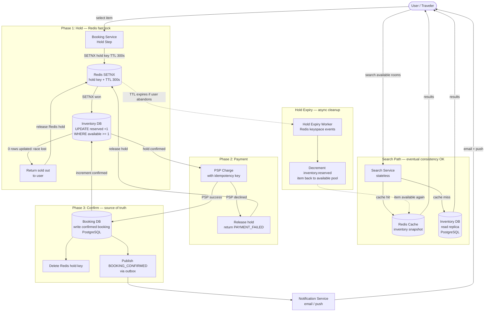
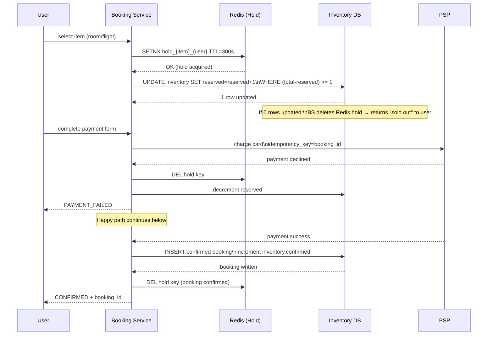
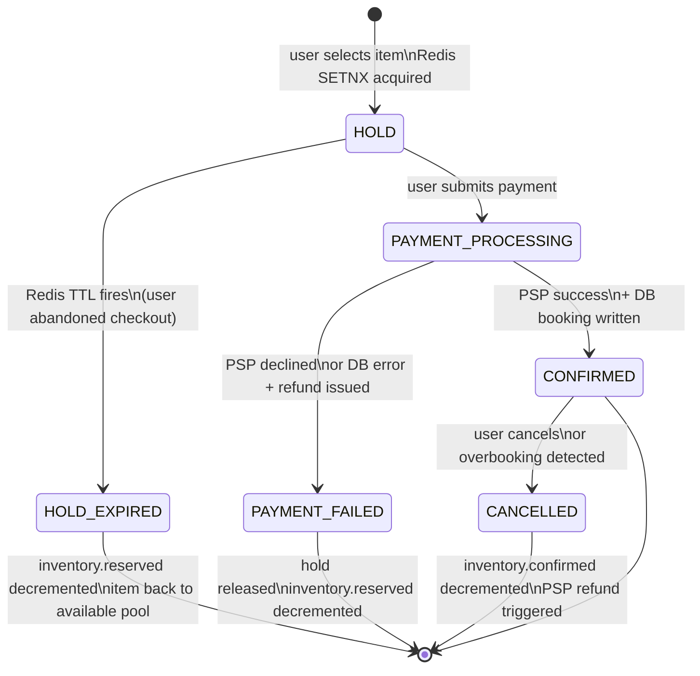

# Solution Guide — Hotel / Flight Booking System

Read after your attempt. If you haven't attempted yet, close this file.

---

## Component Map

| Component | Role | Technology Choice | Why |
|-----------|------|-------------------|-----|
| Search Service | Return available inventory for search queries | Read from Redis cache + Elasticsearch | Serves cached/approximate data; high QPS, eventual consistency OK |
| Inventory Service | Authoritative source of available quantity | PostgreSQL with row-level locking | ACID for inventory decrements; supports optimistic locking via version column |
| Hold Service | Soft-lock a room/seat during checkout | Redis SETNX with TTL | Atomic check-and-set; TTL auto-releases expired holds; single-threaded Redis prevents race |
| Booking Service | Orchestrates SAGA: hold → charge → confirm | Stateful service + Temporal (optional) | Multi-step saga; must handle failures at each step with compensation |
| Payment Service | Charge card via PSP | PSP adapter + idempotency key | Idempotent charge; never double-charge on retry |
| Hold Expiry Worker | Release TTL-expired holds, return inventory | Background scheduler (cron/Kafka) | Prevents inventory starvation from abandoned checkouts |
| Seat Map Service | Per-seat availability for flights | Redis hash per flight + PostgreSQL | Redis for sub-second seat state reads; DB for durability |
| Notification Service | Email/push confirmation | Async queue + email provider | Off hot path; eventual delivery acceptable |

---

## Architecture Diagram



## Sequence Diagram: Hold-Payment-Confirm Flow



## State Diagram: Booking Lifecycle



---

## Capacity Math

**Booking volume:**
- 500K bookings/day ÷ 86,400 = **5.8 writes/sec average**
- Peak (10× for flash sales, seasonal): **58 writes/sec**
- This is a write-light, read-heavy system

**Concurrent holds (peak):**
- 10,000 simultaneous users in checkout at peak
- Each holds 1–4 rooms for average 4–8 minutes
- Peak hold count in Redis: **10,000 keys** (trivially small for Redis)

**Search QPS:**
- 10M searches/day ÷ 86,400 = **116 searches/sec average**
- Peak (morning/evening travel planning spikes): **1,000 searches/sec**
- Must be served from cache, not live DB queries

**Inventory table size (hotels):**
- 5,000 hotels × 20 room types × 730 days = **73 million rows**
- Per row: ~100 bytes → **7.3 GB** — fits in a single PostgreSQL instance
- With sharding by hotel_id: easily scaled if needed

**Seat map (flights):**
- 10,000 flights/day × 200 seats = **2 million seat records/day**
- Each seat: ~50 bytes → **100 MB/day** — trivial storage
- Read QPS for seat maps: flight selection generates ~20 seat map reads per booking attempt = **116 × 20 = 2,320 reads/sec**

---

## API Design

**Search availability:**
```
GET /v1/search?type=hotel&location=Paris&checkin=2025-01-15&checkout=2025-01-18&guests=2
Response 200: {
  "results": [{
    "hotel_id": "hotel_abc",
    "name": "Hotel Paris",
    "room_types": [{
      "type": "DOUBLE",
      "available_count": 3,    // pre-computed, may be slightly stale
      "price_per_night": 15000  // cents
    }]
  }]
}
```

**Create hold (start checkout):**
```
POST /v1/holds
Body: {
  "hotel_id": "hotel_abc",
  "room_type": "DOUBLE",
  "checkin_date": "2025-01-15",
  "checkout_date": "2025-01-18"
}
Response 200: { "hold_id": "hold_xyz", "expires_at": "2025-01-10T14:05:00Z" }
Response 409: { "error": "INVENTORY_UNAVAILABLE", "message": "Room no longer available" }
```

**Complete booking:**
```
POST /v1/bookings
Headers: Idempotency-Key: <UUID>
Body: {
  "hold_id": "hold_xyz",
  "card_token": "tok_visa_123",
  "guest_name": "Jane Doe"
}
Response 200: { "booking_id": "bk_123", "confirmation_code": "ABC123XYZ" }
Response 402: { "error": "PAYMENT_FAILED", "reason": "declined" }
Response 409: { "error": "HOLD_EXPIRED" }
```

**Cancel booking:**
```
DELETE /v1/bookings/{booking_id}
Headers: Idempotency-Key: <UUID>
Response 200: { "refund_amount": 45000, "refund_status": "PROCESSING" }
```

---

## Data Model

**room_type_inventory table (ByteByteGo canonical design):**
```sql
CREATE TABLE room_type_inventory (
  hotel_id        BIGINT NOT NULL,
  room_type_id    BIGINT NOT NULL,
  date            DATE NOT NULL,
  total_inventory INT NOT NULL,    -- total rooms of this type on this date
  total_reserved  INT NOT NULL DEFAULT 0,
  PRIMARY KEY (hotel_id, room_type_id, date),
  CONSTRAINT no_overbooking CHECK(total_inventory - total_reserved >= 0)
);
-- Pre-populated for 2 years ahead = 5,000 × 20 × 730 = 73 million rows
```

**bookings table:**
```sql
CREATE TABLE bookings (
  booking_id       UUID PRIMARY KEY DEFAULT gen_random_uuid(),
  hotel_id         BIGINT NOT NULL,
  room_type_id     BIGINT NOT NULL,
  guest_user_id    UUID NOT NULL,
  checkin_date     DATE NOT NULL,
  checkout_date    DATE NOT NULL,
  amount_cents     BIGINT NOT NULL,
  currency         CHAR(3) NOT NULL,
  status           VARCHAR(20) NOT NULL,  -- PENDING, CONFIRMED, CANCELLED
  psp_charge_id    VARCHAR(128),
  idempotency_key  VARCHAR(128) UNIQUE NOT NULL,
  created_at       TIMESTAMP NOT NULL DEFAULT NOW(),
  INDEX idx_hotel_dates (hotel_id, checkin_date, checkout_date),
  INDEX idx_user (guest_user_id)
);
```

**seats table (flights — per-seat granularity):**
```sql
CREATE TABLE flight_seats (
  flight_id   VARCHAR(32) NOT NULL,
  seat_id     VARCHAR(8) NOT NULL,       -- e.g., "14A"
  cabin       VARCHAR(16) NOT NULL,       -- FIRST, BUSINESS, ECONOMY
  status      VARCHAR(16) NOT NULL DEFAULT 'AVAILABLE',
  held_by     UUID,                       -- user_id while held
  held_until  TIMESTAMP,                  -- TTL for hold
  booked_by   UUID,                       -- user_id once confirmed
  booking_id  UUID,
  PRIMARY KEY (flight_id, seat_id),
  UNIQUE (flight_id, seat_id)             -- DB-level last-resort guard
);
```

**DB type reasoning:** PostgreSQL for all inventory because:
- Inventory updates require ACID transactions (cannot overbook)
- The CHECK constraint `total_inventory - total_reserved >= 0` is a DB-level safety net
- 73 million rows is very comfortable for PostgreSQL with proper indexing
- Row-level locking (`SELECT ... FOR UPDATE`) or optimistic locking (version column) both available
- Redis for holds because: TTL is native, atomic SETNX prevents race conditions, in-memory speed for checkout hot path

---

## Key Design Decisions

### Decision 1: Soft-Lock (Redis Hold) vs. Direct DB Lock

| Dimension | Redis SETNX Hold (5 min TTL) | Pessimistic DB Lock (SELECT FOR UPDATE) |
|-----------|------------------------------|----------------------------------------|
| **Inventory visibility** | Room appears unavailable during hold | Room appears unavailable during lock |
| **TTL expiry** | Native Redis TTL; auto-release | Must implement timeout manually |
| **Failure recovery** | Redis key expires automatically if user abandons | Lock released on transaction end or connection close |
| **Concurrent holding** | Only one SETNX winner | Only one lock holder |
| **Cross-service** | Hold works across services | Lock is per-connection, hard to share |

**Choice: Redis SETNX hold for the checkout window, DB lock for the final commit.** The Redis hold gives us a user-friendly "room reserved for 5 minutes" experience. The DB-level transaction on commit is the correctness backstop — even if the Redis hold somehow expires during a slow payment, the DB CHECK constraint prevents overbooking.

**Trade-off accepted:** Two-layer hold mechanism adds complexity. Redis and DB can be briefly out of sync. Mitigated by: atomic Lua script in Redis (prevents TOCTOU), and DB-level constraint as the final guard.

---

### Decision 2: Optimistic vs. Pessimistic Locking for Inventory Updates

| Dimension | Optimistic Locking (version column) | Pessimistic Locking (SELECT FOR UPDATE) |
|-----------|-------------------------------------|----------------------------------------|
| **Hotel booking (low QPS)** | 5.8 writes/sec — conflicts rare, retry cost low | Works, but holds lock during payment |
| **Flight seat (high contention)** | Popular flights: many concurrent updates → many retries → poor UX | Locks one row, serializes writes — works but reduces throughput |
| **Throughput** | Higher — no lock held during processing | Lower — lock held from SELECT to UPDATE |
| **Retry complexity** | Must handle `UPDATE ... WHERE version = ?` returning 0 rows | Simpler — always succeeds if lock acquired |

**Choice: Optimistic locking for hotel rooms; Redis-based holds + DB atomic UPDATE for flight seats.** ByteByteGo explicitly recommends optimistic locking for hotel booking because QPS is low enough that conflicts are rare and retries are cheap. For flights with high contention (thousands of people selecting seats simultaneously during a flash sale), the Redis hold reduces DB contention by pre-filtering — by the time the booking commits, the hold already establishes exclusivity.

**Trade-off accepted:** Optimistic locking means some users experience retry failures ("room just became unavailable"). This is correct behavior — better to fail fast and ask the user to re-select than to silently overbook.

---

### Decision 3: SAGA vs. 2PC for Charge + Inventory Atomicity

The core problem: charging the card AND decrementing inventory must both succeed or both fail. These are in different services (Payment Service, Inventory Service).

| Dimension | 2PC | SAGA (Orchestrated) |
|-----------|-----|---------------------|
| **External PSP** | PSP cannot join a 2PC | PSP participates via compensating refund API |
| **Availability** | Coordinator crash = all participants blocked | SAGA steps resume independently |
| **Consistency** | Strong atomic | Eventually consistent during saga execution |
| **Latency** | Synchronous, higher | Lower — steps can proceed without global lock |

**Choice: SAGA pattern.**
- Step 1: Create Redis hold
- Step 2: Charge card via PSP (with idempotency key)
- Step 3: Commit inventory in DB (decrement total_reserved)
- Step 4: Delete Redis hold + notify

Compensations:
- Step 2 fails (decline): release Redis hold
- Step 3 fails (DB error): issue PSP refund, release hold
- Step 4 fails: idempotent retry on notification; booking is already committed

**Trade-off accepted:** Brief window between charge and inventory commit where money is in flight. The hold prevents any other booking from succeeding for this inventory. The DB CHECK constraint is the final safety net.

---

## Deep Dive: The Race Condition Between Hold Expiry and Payment

The most insidious failure mode in booking systems:

**The race:**
1. User holds seat 14A on flight UA123 (TTL = 300 seconds)
2. User completes 3D Secure authentication — this takes 180 seconds
3. User clicks "Confirm" — payment begins
4. At second 295 of the hold (5 seconds before expiry), Redis TTL fires
5. Hold expiry worker sees 14A is now available, returns it to pool
6. Another user immediately holds 14A (new 300-second TTL)
7. Original user's payment succeeds at second 310
8. Booking service tries to commit 14A — but 14A is now held by another user

**How to handle this:**

Option A: Renew hold TTL when 3D Secure authentication begins. Extend from 300 to 600 seconds. The booking service renews by calling `EXPIRE hold_key 600`. This gives the user time to complete authentication.

Option B: At booking commit time (Step 3), check if the Redis hold still exists AND belongs to this user. If not, issue the refund and return HOLD_EXPIRED to the user.

```
# Booking Service logic at Step 3:
hold_value = redis.get("hold:flight_123:14A")
if hold_value != current_user_id:
    # hold expired and was re-acquired by someone else
    issue_refund(charge_id)
    return error(HOLD_EXPIRED)
# proceed with DB commit
```

The DB-level UNIQUE constraint on `(flight_id, seat_id)` with `status='BOOKED'` is the final backstop — even if the hold check passes, the DB write fails if another booking already committed.

**Ticketmaster's approach:** 300-second TTL with no extension. If the user's session takes longer than 5 minutes (including 3D Secure), the hold expires and they must re-select from the available inventory. This is the correct trade-off for high-demand events: keeping inventory locked for 10 minutes per user would dramatically reduce perceived availability.

---

## Failure Modes & Mitigations

| Failure | Impact | Detection | Mitigation |
|---------|--------|-----------|------------|
| User abandons checkout | Inventory locked for TTL duration | Hold key expires | Redis TTL auto-releases; Hold Expiry Worker decrements total_reserved |
| Payment fails (card declined) | User charged declined; hold remains | PSP 402 response | Release Redis hold immediately; do NOT commit inventory |
| Server crash mid-SAGA (after charge, before DB commit) | Card charged, no booking | Reconciliation: PSP charge without booking record | SAGA state recovery: detect orphaned PSP charges; issue refund or commit booking depending on inventory state |
| Double-click submit | Two identical booking requests | Both reach booking service simultaneously | Idempotency key (booking attempt ID) deduplicates; DB UNIQUE on idempotency_key |
| Hold expiry race during payment | Two users hold same seat simultaneously | Redis SETNX: only one wins | Lua script enforces atomicity; second SETNX returns 0 (conflict) |
| Inventory DB primary failure | Bookings fail; searches serve stale data | DB connection errors | Read replica for search; writes queue during failover; replica promotion < 30s |
| Overbooking (inventory counter desync) | More bookings than rooms | CHECK constraint violation | DB-level CHECK prevents it; compensate with room upgrade or relocation |

---

## What Strong Candidates Do

1. **Separate search path from booking path immediately.** Search tolerates stale data and must be fast (cache-served). Booking requires strong consistency. These are different services with different databases and different consistency requirements.
2. **Design the hold explicitly as a Redis key with TTL** — name the SETNX atomicity and explain why TTL is the self-healing mechanism for abandoned checkouts.
3. **State the two-layer guarantee:** Redis hold for user experience (5-minute reservation window) + DB CHECK constraint for correctness (last resort).
4. **Address the hold expiry during payment race condition** — this is the most interesting failure mode. Strong candidates name it and present a concrete solution (extend TTL during 3D Secure, or check hold existence before commit).
5. **Choose optimistic locking for hotels and justify it** with the ByteByteGo reasoning: QPS is low, conflicts are rare, retries are cheap. Know the alternative (pessimistic locking) and when to use it (flight seats with high contention).
6. **Know that hotels also overbook** — not just airlines. Hotels "walk" guests to comparable properties when overbooked. This is deliberate and economically motivated (unsold room nights are pure loss). Saying "only airlines overbook" is factually wrong.

---

## What Average Candidates Miss

1. **Conflating search and booking paths.** Single service that queries the DB on every search call. At 1,000 searches/sec, this saturates PostgreSQL. Search must be served from cache (Redis/Elasticsearch) with acceptable staleness.

2. **No hold mechanism.** Designs that jump directly from "user selects room" to "charge card." Without a hold, the period between selection and payment completion has no inventory lock. Two users can concurrently reach the payment step for the same room, and only one can succeed — but both have already entered card details. The losing user's card is authorized then immediately refunded, which is a terrible experience.

3. **Proposing 2PC for card + inventory atomicity.** PSP cannot participate in a 2PC. SAGA is the correct pattern. Proposing 2PC signals unfamiliarity with distributed transaction realities.

4. **Assuming hotels don't overbook.** Booking.com and other major OTAs regularly handle hotel overbooking. The handling is different from airlines (relocation vs. bumping), but the problem exists. Getting this wrong misses nuance the interviewer expects.

5. **Hold without expiry worker.** Redis TTL removes the key, but someone must update the inventory DB. If the hold expiry worker doesn't decrement `total_reserved`, the inventory DB shows the room as reserved forever. The search cache never shows it as available again.
